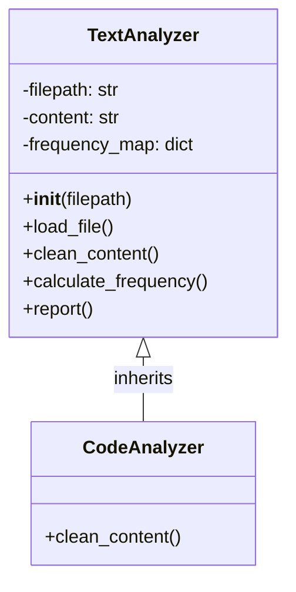
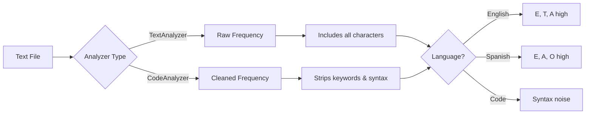
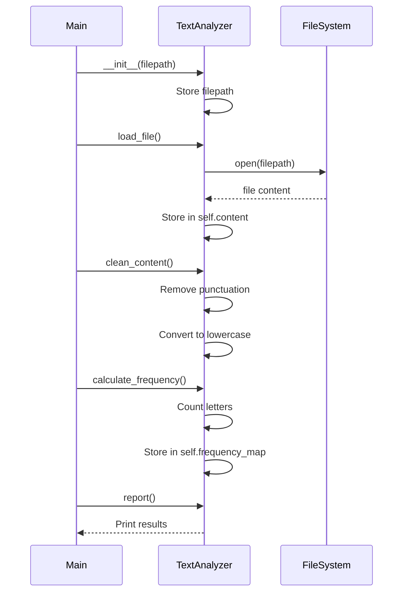
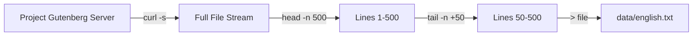

# Lab 01 Field Manual: Core Concepts

This document serves as your technical reference for the Rosetta Frequency investigation. Review these concepts before beginning the lab.

---

## 1. Object-Oriented Programming (OOP)

### What is a Class?
A **class** is a blueprint for creating objects. It encapsulates both **state** (data stored in attributes) and **behavior** (functions called methods).

**Key Difference from Scripting:**
- **Script**: Variables and functions floating in global scope. Hard to reuse or maintain.
- **Class**: Self-contained unit that packages related data and operations together.

### Encapsulation
**Encapsulation** means bundling data and the methods that operate on that data within a single unit (the class). This prevents external code from directly manipulating internal state.

**Example:**
```python
# Bad: Global variables and functions
text = "Hello World"
frequency = {}

def count_letters():
    global text, frequency
    # ... logic ...

# Good: Encapsulated in a class
class TextAnalyzer:
    def __init__(self, filepath):
        self.filepath = filepath
        self.content = ""
        self.frequency_map = {}

    def calculate_frequency(self):
        # Works on self.content
        pass
```

### Inheritance
**Inheritance** allows you to create a new class (subclass) based on an existing class (superclass). The subclass inherits all attributes and methods from the parent but can override or extend them.

**Use Case:** When you need specialized behavior but want to reuse existing logic.

```python
class TextAnalyzer:
    def clean_content(self):
        # Remove punctuation, numbers
        pass

class CodeAnalyzer(TextAnalyzer):
    def clean_content(self):
        # Override: Also remove programming keywords
        pass
```

**Class Hierarchy Diagram:**



---

## 2. File I/O and Encoding

### The Encoding Problem
Computers store text as sequences of bytes. The **encoding** defines how to translate characters (like 'A' or 'ñ') into bytes and vice versa.

**The Critical Issue:**
Text files don't store their encoding as metadata. When you open a file, the program must **guess** or rely on defaults—and wrong guesses cause corruption or crashes.

**Common Encodings:**
- **ASCII**: 128 characters (English only, no accents). 1 byte per character.
- **UTF-8**: Universal. Supports all languages. Variable length (1-4 bytes per character).
- **Latin-1 (ISO-8859-1)**: 256 characters. Western European languages. 1 byte per character.
- **UTF-16**: Unicode encoding using 2 or 4 bytes per character. Used internally by Windows, Java, JavaScript.

**The Trap:**
If you open a file with the wrong encoding, you'll get:
- **Gibberish**: Characters display incorrectly (e.g., 'ñ' becomes 'ñ').
- **UnicodeDecodeError**: Python crashes because the bytes don't match the expected encoding.

---

### Operating System Encoding Defaults

Encoding is **partially** tied to operating systems, though not strictly enforced.

#### OS-Specific Conventions

Different operating systems have historically used different **default** encodings:

- **Windows**: Traditionally used **CP-1252** (Western Europe) or other code pages depending on region. Modern Windows uses UTF-16 internally for system functions.
- **Linux/Unix**: Typically default to **UTF-8** (especially modern distributions).
- **macOS**: Also defaults to **UTF-8**.

#### What OSes Control

Operating systems **do** enforce some encoding-related behaviors:

1. **Line Endings** (text file structure):
   - Windows: `\r\n` (CRLF - Carriage Return + Line Feed)
   - Linux/macOS: `\n` (LF - Line Feed only)

2. **Filesystem Encoding**: How filenames themselves are encoded
   - Modern systems use UTF-8 for filenames
   - Windows uses UTF-16 for filesystem APIs

3. **Console/Terminal Encoding**: What encoding the terminal expects for display

#### What OSes Don't Control

The OS **doesn't** dictate what encoding you must use for file *contents*. You can save a file in any encoding (UTF-8, UTF-16, ASCII, Latin-1, etc.) on any OS. The encoding is just **metadata** about how to interpret the bytes.

#### The Cross-Platform Problem

Files created on one OS may fail to open correctly on another:
- A file saved on Windows (CP-1252) may corrupt when opened on Linux (expecting UTF-8)
- Different editors assume different default encodings
- Python's `open()` uses the system default if no encoding is specified

**Modern Best Practice:** **UTF-8** is now the universal standard and works across all operating systems.

---

### Encoding Comparison: What You Need to Know

#### ASCII
- **Coverage**: 128 characters (English letters, digits, basic punctuation only)
- **Storage**: 1 byte per character
- **Limitation**: Can't represent accents (é, ñ) or non-English characters

#### UTF-8 (Recommended Standard)
- **Coverage**: All languages and symbols (1+ million characters)
- **Storage**: Variable-length (1-4 bytes per character)
  - English text: 1 byte per character (same as ASCII)
  - Accented letters (ñ, é): 2 bytes
  - Chinese, Arabic, emoji: 3-4 bytes
- **Key advantage**: Backward compatible with ASCII
- **When to use**: Default for new files, web content, cross-platform projects

**Example:**
```
'A'  → 1 byte  (0x41)
'ñ'  → 2 bytes (0xC3 0xB1)
'中' → 3 bytes (0xE4 0xB8 0xAD)
```

#### Latin-1 (ISO-8859-1)
- **Coverage**: 256 characters (Western European languages only)
- **Storage**: Always 1 byte per character
- **Limitation**: Can't represent Asian languages, emoji, or currency symbols like €
- **When to encounter**: Legacy files, older European documents

**The Lab 01 Trap:**
Latin-1 stores 'ñ' as a single byte (`0xF1`). UTF-8 stores it as two bytes (`0xC3 0xB1`). If you try to read a Latin-1 file with UTF-8, Python crashes with `UnicodeDecodeError` because byte `0xF1` alone is invalid in UTF-8.

**Example:**
```
'A'  → 1 byte (0x41)
'ñ'  → 1 byte (0xF1)  ← This breaks UTF-8!
'€'  → Cannot represent
```

#### UTF-16 (For Context Only)
- **Coverage**: All Unicode characters
- **Storage**: 2 or 4 bytes per character
- **Not ASCII compatible** (even 'A' takes 2 bytes)
- **When to encounter**: Windows internals, Java/JavaScript string handling
- **Not used in this lab**

#### Quick Comparison

| Encoding | Bytes/Char | ASCII Compatible | Best For |
|----------|------------|------------------|----------|
| **ASCII** | 1 | ✓ (it IS ASCII) | English only |
| **Latin-1** | 1 | ✓ | Western European (legacy) |
| **UTF-8** | 1-4 | ✓ | Universal (modern standard) |
| **UTF-16** | 2-4 | ✗ | Windows internals only |

---

### Safe File Reading in Python

#### Always Specify the Encoding

**Bad Practice (system-dependent):**
```python
# Uses OS default (UTF-8 on Linux, CP-1252 on Windows)
with open('file.txt', 'r') as f:
    content = f.read()
```

**Good Practice (explicit):**
```python
# Explicit encoding ensures consistent behavior across systems
with open('file.txt', 'r', encoding='utf-8') as f:
    content = f.read()
```

#### Handling Unknown Encodings: The Forensic Approach

When you encounter a file of unknown encoding, use a fallback strategy:

```python
def load_file_safe(filepath):
    """Attempt multiple encodings with forensic logging."""
    encodings = ['utf-8', 'latin-1', 'cp1252']

    for encoding in encodings:
        try:
            with open(filepath, 'r', encoding=encoding) as f:
                content = f.read()
            print(f"✓ Successfully decoded with {encoding}")
            return content
        except UnicodeDecodeError:
            print(f"✗ Failed to decode with {encoding}")
            continue

    # Last resort: ignore errors (not recommended for production)
    with open(filepath, 'r', encoding='utf-8', errors='ignore') as f:
        print(f"⚠ Warning: Loaded with error suppression")
        return f.read()
```

#### The `errors` Parameter

When opening files, you can control how encoding errors are handled:

```python
# Strict (default): Raise UnicodeDecodeError
with open('file.txt', 'r', encoding='utf-8', errors='strict') as f:
    content = f.read()

# Ignore: Skip invalid bytes silently (data loss!)
with open('file.txt', 'r', encoding='utf-8', errors='ignore') as f:
    content = f.read()

# Replace: Substitute invalid bytes with � (U+FFFD)
with open('file.txt', 'r', encoding='utf-8', errors='replace') as f:
    content = f.read()
```

**Recommendation for This Lab:**
Use `try/except` with multiple encodings rather than `errors='ignore'`. Data loss is unacceptable in forensic analysis.

---

### Context Managers (`with` statement)
The `with` statement automatically closes files even if an error occurs.

```python
# Manual (error-prone):
f = open('file.txt', 'r')
content = f.read()
f.close()  # What if an error happens before this?

# Context manager (safe):
with open('file.txt', 'r', encoding='utf-8') as f:
    content = f.read()
# File automatically closed here, even if an exception occurs
```

**Why This Matters:**
- **Resource Leaks**: Unclosed files consume system resources
- **File Locks**: On Windows, unclosed files may remain locked, preventing other programs from accessing them
- **Data Integrity**: Buffers may not flush to disk without proper closure

---

### Practical Encoding Forensics: Terminal Investigation

Before writing Python code, use command-line tools to investigate file encodings.

#### Check File Type and Encoding Hints
```bash
# Check file metadata (may detect encoding)
file data/english.txt
# Output: data/english.txt: UTF-8 Unicode text

file data/corrupt.txt
# Output: data/corrupt.txt: ISO-8859 text
```

#### Examine Raw Bytes (Hexdump)
```bash
# View first 100 bytes in hex
xxd data/spanish.txt | head -n 10

# Look for BOM (Byte Order Mark)
# UTF-8 BOM:    EF BB BF
# UTF-16 LE:    FF FE
# UTF-16 BE:    FE FF
```

#### Test Encoding with `iconv`
```bash
# Convert from latin-1 to utf-8
iconv -f ISO-8859-1 -t UTF-8 data/corrupt.txt > data/fixed.txt

# If conversion succeeds, you've identified the encoding
```

---

### The Lab 01 Encoding Challenge

One of the evidence files (`corrupt.txt` or similar) is intentionally saved with **Latin-1 (ISO-8859-1)** encoding and contains non-ASCII characters like:
- **ñ** (Spanish eñe)
- **á, é, í, ó, ú** (accented vowels)

**What Happens:**
1. Your initial script tries to open it with `encoding='utf-8'` (or no encoding specified)
2. Python encounters byte `0xF1` (ñ in Latin-1)
3. **Crash**: `UnicodeDecodeError: 'utf-8' codec can't decode byte 0xf1`

**Your Mission:**
Design your `TextAnalyzer.load_file()` method to handle this gracefully using `try/except` blocks and fallback encodings.

---

### Encoding Best Practices Summary

1. **Always specify encoding explicitly** when opening files
2. **Default to UTF-8** unless you have a specific reason not to
3. **Use `try/except`** to handle encoding errors gracefully
4. **Never use `errors='ignore'`** in production forensic tools (data loss)
5. **Test with diverse input** (ASCII, UTF-8, Latin-1, special characters)
6. **Investigate before coding** (use `file`, `xxd`, `iconv` to probe unknown files)

---

## 3. Data Structures for Analysis

### Dictionaries
Dictionaries store key-value pairs. Perfect for counting frequencies.

```python
# Letter frequency map
frequency = {
    'a': 105,
    'b': 23,
    'c': 47,
    # ...
}

# Incrementing a counter
letter = 'a'
if letter in frequency:
    frequency[letter] += 1
else:
    frequency[letter] = 1

# Better: Use .get() with default
frequency[letter] = frequency.get(letter, 0) + 1
```

### Sorting Dictionaries
To find the most frequent letters:
```python
# Sort by value (frequency), descending
sorted_items = sorted(frequency.items(), key=lambda x: x[1], reverse=True)

# Get top 5
top_5 = sorted_items[:5]

# Print
for letter, count in top_5:
    print(f"{letter}: {count}")
```

---

## 4. String Manipulation

### Cleaning Text
Common operations for linguistic analysis:

```python
text = "Hello, World! 123"

# Convert to lowercase
text = text.lower()  # "hello, world! 123"

# Remove punctuation (manual)
import string
text = ''.join(char for char in text if char not in string.punctuation)
# "hello world 123"

# Remove digits
text = ''.join(char for char in text if not char.isdigit())
# "hello world "

# Keep only alphabetic characters
text = ''.join(char for char in text if char.isalpha() or char.isspace())
# "hello world "
```

### Regular Expressions (Advanced)
For complex cleaning (e.g., removing comments from code):
```python
import re

# Remove Python comments (# to end of line)
code = re.sub(r'#.*', '', code)

# Remove function keywords
code = re.sub(r'\b(def|return|class|import|if|else|for|while)\b', '', code)
```

---

## 5. Letter Frequency in Natural Language

Different languages have distinctive letter frequency patterns. This is the basis of cryptanalysis and linguistic forensics.

**English:**
- Most common: E, T, A, O, I, N
- Least common: Z, Q, X, J

**Spanish:**
- Most common: E, A, O, S, R, N
- Contains unique: Ñ

**Python Code:**
- High frequency of: `e`, `t`, `r`, `n` (from keywords like `return`, `def`, `self`)
- Unusual characters: `_`, `:`, `(`, `)`

**Frequency Distribution Comparison:**



---

## 6. The Class Lifecycle

Understanding how objects are created and used:



---

## 7. Exception Handling

**Why Exception Handling?**
Files may not exist, encodings may be wrong, or division by zero may occur. Robust code anticipates failure.

```python
try:
    # Risky operation
    with open(filepath, 'r', encoding='utf-8') as f:
        content = f.read()
except FileNotFoundError:
    print(f"Error: File '{filepath}' not found.")
except UnicodeDecodeError:
    print(f"Error: File has encoding issues. Try 'latin-1'.")
except Exception as e:
    print(f"Unexpected error: {e}")
```

---

## 8. Unix Pipeline Composition (Bonus: Data Acquisition)

This section explains how the evidence files were created using command-line tools. Understanding pipeline composition is a valuable forensic skill.

### The Command Used

The control sample files were created with this command:

```bash
curl -s "https://www.gutenberg.org/files/84/84-0.txt" | head -n 500 | tail -n +50 > data/english.txt
```

### Breaking Down the Pipeline

**Pipeline Operator (`|`):**
The pipe symbol connects commands, sending the output of one command as input to the next. This allows you to chain operations without creating temporary files.

**Step-by-Step Execution:**

1. **`curl -s "URL"`** - Download the file
   - `curl`: Command-line tool for transferring data from URLs
   - `-s`: Silent mode (suppresses progress meter and errors)
   - Output: The entire file content streamed to stdout

2. **`| head -n 500`** - Take the first 500 lines
   - `head`: Outputs the beginning of a file
   - `-n 500`: Limit to first 500 lines
   - Purpose: Grab a manageable sample (the full book is thousands of lines)
   - Output: Lines 1-500 from the downloaded file

3. **`| tail -n +50`** - Skip the header
   - `tail`: Outputs the end of a file
   - `-n +50`: Start from line 50 onwards (NOT the last 50 lines!)
   - Purpose: Remove Project Gutenberg's legal header/metadata (lines 1-49)
   - Output: Lines 50-500 (clean story text)

4. **`> data/english.txt`** - Save to file
   - `>`: Redirect operator (writes stdout to a file)
   - Creates or overwrites the target file

### The Full Data Flow



### Why Use Pipelines Instead of Multiple Commands?

**Without Pipelines (inefficient):**
```bash
curl -s "URL" > temp_full.txt
head -n 500 temp_full.txt > temp_500.txt
tail -n +50 temp_500.txt > english.txt
rm temp_full.txt temp_500.txt
```

**With Pipelines (efficient):**
```bash
curl -s "URL" | head -n 500 | tail -n +50 > english.txt
```

**Advantages:**
- No temporary files cluttering the disk
- Faster (streams data instead of repeated disk I/O)
- More composable (easy to add more processing steps)
- Memory efficient (processes data as it flows, not all at once)

### Essential Data Investigation Commands

#### The `wc` Command (Word Count)

`wc` is a fundamental forensic tool for getting quick statistics about files:

```bash
wc data/english.txt
# Output: lines words bytes filename
#    451  3821  24134 data/english.txt
```

**Common flags:**
- `wc -l` : Count lines only
- `wc -w` : Count words only
- `wc -c` : Count bytes only
- `wc -m` : Count characters (respects multi-byte encodings like UTF-8)

**Practical examples:**
```bash
# How many lines in the artifact?
wc -l data/artifact.py

# Count total files in a directory
ls data/ | wc -l

# How many Python functions are defined?
grep "^def " analyzer.py | wc -l

# Size comparison of all evidence files
wc -c data/*
```

**In pipelines:**
```bash
# Count error occurrences in a log
grep "ERROR" server.log | wc -l

# Count unique IP addresses
cat access.log | cut -d' ' -f1 | sort | uniq | wc -l
```

### Common Pipeline Patterns for Data Forensics

**Extract and count:**
```bash
curl -s "URL" | grep "error" | wc -l
# Download, filter for errors, count matches
```

**Download, clean, and analyze:**
```bash
curl -s "URL" | tr -d '[:punct:]' | tr '[:upper:]' '[:lower:]' | sort | uniq -c
# Download, remove punctuation, lowercase, sort, count unique words
```

**Sample large files:**
```bash
cat large_file.txt | head -n 10000 | tail -n +100 > sample.txt
# Extract lines 100-10000 from a huge file
```

### Try It Yourself

Experiment with these commands to understand each component:

```bash
# See what head does alone
echo -e "line1\nline2\nline3\nline4\nline5" | head -n 3

# See what tail -n +3 does (start from line 3)
echo -e "line1\nline2\nline3\nline4\nline5" | tail -n +3

# Combine them
echo -e "line1\nline2\nline3\nline4\nline5" | head -n 4 | tail -n +2
# Should output: line2, line3, line4
```

### When to Use Command-Line Pipelines vs Python

**Use CLI Pipelines when:**
- Quick data exploration or sampling
- Simple transformations (filter, count, extract)
- One-off data acquisition
- Working with very large files (stream processing)

**Use Python when:**
- Complex logic or calculations
- Need to maintain state across operations
- Building reusable tools (like our TextAnalyzer)
- Advanced data structures or algorithms required

---

## Summary Checklist

Before starting the lab, ensure you understand:

**Object-Oriented Programming:**
- [ ] The difference between a script and a class
- [ ] What `self` refers to in methods
- [ ] How `__init__()` initializes object state
- [ ] How inheritance allows you to override methods

**File I/O and Encoding:**
- [ ] Why encoding matters when reading files
- [ ] The difference between UTF-8, Latin-1, and ASCII
- [ ] Why UTF-8 is backward-compatible with ASCII (but UTF-16 is not)
- [ ] How OS defaults affect file encoding (Windows vs Linux/macOS)
- [ ] How to specify explicit encoding in Python's `open()`
- [ ] How to use `try/except` to handle `UnicodeDecodeError`
- [ ] How to use `with` statements for safe file I/O
- [ ] Why `errors='ignore'` should be avoided in forensic analysis

**Data Processing:**
- [ ] How to count occurrences using dictionaries
- [ ] How to sort dictionaries by value to find top frequencies

**Exception Handling:**
- [ ] Why try/except blocks prevent crashes
- [ ] How to handle `FileNotFoundError` and `UnicodeDecodeError`

**Bonus:**
- [ ] How Unix pipelines compose commands for data processing
- [ ] How to use `file`, `xxd`, and `iconv` for encoding forensics

**Proceed to the lab when ready.**
