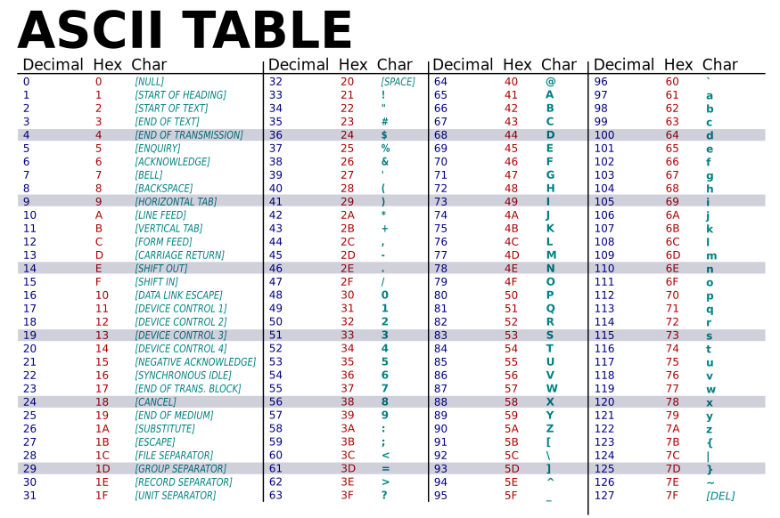
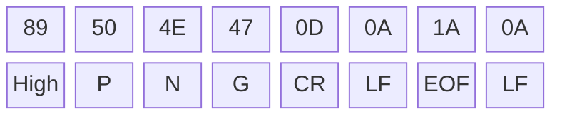
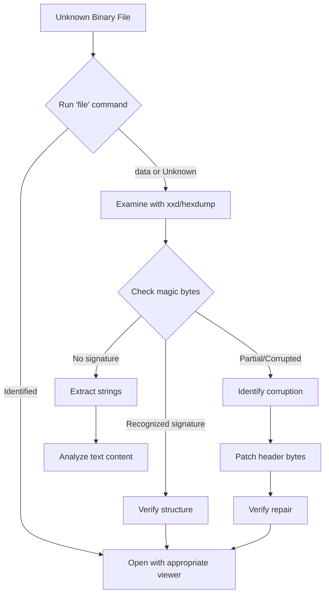

# Lab 02 Field Manual: Core Concepts

This document serves as your technical reference for the Hex Detective investigation. Review these concepts before beginning the lab.

---

## 1. Hexadecimal Numbering System

### Why Hexadecimal?
Computers store everything as binary (0s and 1s), but binary is tedious for humans. Hexadecimal (base-16) provides a compact representation:

- **Binary**: Base-2 (digits: 0, 1)
- **Decimal**: Base-10 (digits: 0-9)
- **Hexadecimal**: Base-16 (digits: 0-9, A-F)

**The Key Insight:** One hex digit represents exactly 4 bits (a "nibble"), so two hex digits represent one byte (8 bits).

### Hex Digit Values

| Hex | Decimal | Binary |
|-----|---------|--------|
| 0   | 0       | 0000   |
| 1   | 1       | 0001   |
| 2   | 2       | 0010   |
| 3   | 3       | 0011   |
| 4   | 4       | 0100   |
| 5   | 5       | 0101   |
| 6   | 6       | 0110   |
| 7   | 7       | 0111   |
| 8   | 8       | 1000   |
| 9   | 9       | 1001   |
| A   | 10      | 1010   |
| B   | 11      | 1011   |
| C   | 12      | 1100   |
| D   | 13      | 1101   |
| E   | 14      | 1110   |
| F   | 15      | 1111   |

### Conversion Examples

**Hex to Decimal:**
```
0x41 = 4×16 + 1×1 = 64 + 1 = 65 (ASCII 'A')
0xFF = 15×16 + 15×1 = 240 + 15 = 255 (max byte value)
0x89 = 8×16 + 9×1 = 128 + 9 = 137
```

**Decimal to Hex:**
```
65 ÷ 16 = 4 remainder 1 → 0x41
255 ÷ 16 = 15 remainder 15 → 0xFF
137 ÷ 16 = 8 remainder 9 → 0x89
```

### Common Hex Patterns to Recognize

| Hex | Decimal | Meaning |
|-----|---------|---------|
| `00` | 0 | Null byte |
| `0A` | 10 | Line Feed (LF, `\n`) |
| `0D` | 13 | Carriage Return (CR, `\r`) |
| `20` | 32 | Space character |
| `41-5A` | 65-90 | Uppercase A-Z |
| `61-7A` | 97-122 | Lowercase a-z |
| `FF` | 255 | Maximum byte value |

---

<details>
<summary>ASCII Table Reference</summary>



</details>

---

## 2. Text vs Binary File Modes

### The Fundamental Difference

When you open a file, you must decide how to interpret its bytes:

**Text Mode (`'r'`, `'w'`):**
- Python decodes bytes into Unicode strings
- Line endings may be translated (`\r\n` → `\n` on Windows)
- Requires an encoding (UTF-8, Latin-1, etc.)
- Crashes on invalid byte sequences

**Binary Mode (`'rb'`, `'wb'`):**
- Python reads/writes raw bytes
- No encoding or decoding
- No line ending translation
- Every byte is preserved exactly

### When to Use Each Mode

| Use Case | Mode | Why |
|----------|------|-----|
| Text documents (.txt, .md, .csv) | Text | Need to process characters |
| Images (.png, .jpg, .gif) | Binary | Raw pixel/compression data |
| Executables (.exe, .elf) | Binary | Machine code |
| Archives (.zip, .tar) | Binary | Compressed data |
| Unknown files | Binary | Safe default |

### Python File Mode Reference

```python
# Text modes
'r'   # Read text (default)
'w'   # Write text (overwrites)
'a'   # Append text
'r+'  # Read and write text

# Binary modes
'rb'  # Read binary
'wb'  # Write binary (overwrites)
'ab'  # Append binary
'r+b' # Read and write binary
```

### Example: The Difference in Practice

```python
# Text mode - bytes are decoded to strings
with open('file.txt', 'r', encoding='utf-8') as f:
    content = f.read()
    print(type(content))  # <class 'str'>
    print(content[0])     # First character (e.g., 'H')

# Binary mode - raw bytes
with open('file.txt', 'rb') as f:
    data = f.read()
    print(type(data))     # <class 'bytes'>
    print(data[0])        # First byte as integer (e.g., 72 for 'H')
```

---

## 3. The `bytes` and `bytearray` Types

### `bytes` - Immutable Byte Sequence

```python
# Create bytes from a literal
data = b'Hello'
print(data)        # b'Hello'
print(data[0])     # 72 (ASCII value of 'H')
print(len(data))   # 5

# Create bytes from hex
data = bytes.fromhex('89504E47')
print(data)        # b'\x89PNG'

# Create bytes from a list of integers
data = bytes([137, 80, 78, 71])
print(data)        # b'\x89PNG'

# bytes are IMMUTABLE - this fails:
# data[0] = 0x00  # TypeError!
```

### `bytearray` - Mutable Byte Sequence

```python
# Create bytearray (same ways as bytes)
data = bytearray(b'Hello')
data = bytearray.fromhex('89504E47')
data = bytearray([137, 80, 78, 71])

# bytearray IS MUTABLE - this works:
data[0] = 0x00    # Modify first byte
print(data)       # bytearray(b'\x00PNG')

# Useful methods
data.append(0x0A)           # Add byte at end
data.extend(b'\r\n')        # Add multiple bytes
data.insert(0, 0xFF)        # Insert at position
del data[0]                 # Delete byte
```

### Converting Between Types

```python
# bytes to bytearray (to make editable)
immutable = b'\x89PNG'
mutable = bytearray(immutable)
mutable[0] = 0x00

# bytearray to bytes (to make hashable/storable)
edited = bytes(mutable)

# bytes to hex string
data = b'\x89PNG'
hex_str = data.hex()        # '89504e47'

# hex string to bytes
data = bytes.fromhex('89504e47')
```

### Slicing Bytes

```python
data = b'\x89PNG\r\n\x1a\n'

# Slicing works like strings
header = data[:4]      # b'\x89PNG' (first 4 bytes)
rest = data[4:]        # b'\r\n\x1a\n' (remaining)
middle = data[1:4]     # b'PNG' (bytes 1-3)

# Single index returns integer, slice returns bytes
print(data[0])         # 137 (integer)
print(data[0:1])       # b'\x89' (bytes)
```

---

## 4. Magic Bytes (File Signatures)

### What Are Magic Bytes?

**Magic bytes** (also called "file signatures" or "magic numbers") are specific byte sequences at the beginning of a file that identify its format. The operating system and applications use these bytes—not the file extension—to determine how to process a file.

**Why They Exist:**
1. File extensions can be changed or removed
2. Files can be transmitted without metadata
3. Security tools need to verify file types

### File Extensions vs Magic Numbers

**File Extensions (`.txt`, `.jpg`, `.exe`):**
- User-facing hints about file type and default application
- Easily changed by renaming—unreliable for security
- Legacy systems (DOS, early Windows) relied heavily on them

**Magic Numbers (Embedded Bytes):**
- Internal identifiers in the file's binary content
- Cannot be changed by renaming—authoritative verification
- Used by modern systems and security tools

**Modern Approach:**
- **Hybrid system**: Extensions for convenience, magic numbers for verification
- **Extensions**: Set icons, default programs, user experience
- **Magic numbers**: Confirm file type when accuracy/security matters (e.g., `file` command)
- **MIME types**: Web identifiers (e.g., `image/png`, `text/plain`) derived from extensions or magic numbers

**Key Principle:** Trust magic numbers, not extensions, for security-critical operations.

### Common File Signatures

| File Type | Magic Bytes (Hex) | ASCII Representation | Offset |
|-----------|-------------------|----------------------|--------|
| **PNG** | `89 50 4E 47 0D 0A 1A 0A` | `.PNG....` | 0 |
| **JPEG** | `FF D8 FF` | `...` (non-printable) | 0 |
| **GIF87a** | `47 49 46 38 37 61` | `GIF87a` | 0 |
| **GIF89a** | `47 49 46 38 39 61` | `GIF89a` | 0 |
| **PDF** | `25 50 44 46` | `%PDF` | 0 |
| **ZIP** | `50 4B 03 04` | `PK..` | 0 |
| **RAR** | `52 61 72 21 1A 07` | `Rar!..` | 0 |
| **ELF** (Linux) | `7F 45 4C 46` | `.ELF` | 0 |
| **PE/EXE** (Windows) | `4D 5A` | `MZ` | 0 |
| **MP3** | `FF FB` or `49 44 33` | `..` or `ID3` | 0 |
| **WAV** | `52 49 46 46` | `RIFF` | 0 |
| **SQLite** | `53 51 4C 69 74 65` | `SQLite` | 0 |

### PNG Signature Deep Dive

The PNG signature is 8 bytes with specific meanings:

```
Byte 0: 0x89 - High bit set (detects transmission errors)
Byte 1: 0x50 - 'P'
Byte 2: 0x4E - 'N'
Byte 3: 0x47 - 'G'
Byte 4: 0x0D - Carriage Return (detects \r\n conversion)
Byte 5: 0x0A - Line Feed (detects \n issues)
Byte 6: 0x1A - End-of-file marker (stops old DOS TYPE command)
Byte 7: 0x0A - Line Feed (another conversion check)
```



### Detecting File Types in Python

```python
# Simple signature detection
MAGIC_SIGNATURES = {
    b'\x89PNG\r\n\x1a\n': 'PNG',
    b'\xff\xd8\xff': 'JPEG',
    b'GIF87a': 'GIF',
    b'GIF89a': 'GIF',
    b'%PDF': 'PDF',
    b'PK\x03\x04': 'ZIP',
    b'\x7fELF': 'ELF',
    b'MZ': 'PE/EXE',
}

def detect_file_type(filepath):
    with open(filepath, 'rb') as f:
        header = f.read(16)  # Read enough for any signature

    for signature, file_type in MAGIC_SIGNATURES.items():
        if header.startswith(signature):
            return file_type

    return 'Unknown'
```

---

## 5. CLI Forensic Tools

### The `file` Command

The `file` command identifies file types based on magic bytes:

```bash
$ file image.png
image.png: PNG image data, 100 x 100, 8-bit/color RGB, non-interlaced

$ file mystery.bin
mystery.bin: PNG image data, 100 x 100, 8-bit/color RGB, non-interlaced

$ file corrupted.png
corrupted.png: data  # Cannot identify - signature is broken
```

### The `xxd` Command (Hex Dump)

`xxd` creates a hex dump of a file:

```bash
$ xxd image.png | head -n 4
00000000: 8950 4e47 0d0a 1a0a 0000 000d 4948 4452  .PNG........IHDR
00000010: 0000 0064 0000 0064 0806 0000 0070 e295  ...d...d.....p..
00000020: 5400 0000 0173 5247 4200 aece 1ce9 0000  T....sRGB.......
00000030: 0004 6741 4d41 0000 b18f 0bfc 6105 0000  ..gAMA......a...
```

**Reading the output:**
- Column 1: Byte offset (hex)
- Column 2-9: Hex bytes (grouped in pairs)
- Column 10: ASCII representation (`.` for non-printable)

**Useful flags:**
```bash
xxd -l 32 file     # Limit to first 32 bytes
xxd -s 100 file    # Skip to offset 100
xxd -c 8 file      # 8 bytes per line (default 16)
xxd -b file        # Binary output instead of hex
```

### The `hexdump` Command

Alternative to `xxd` with different formatting:

```bash
$ hexdump -C image.png | head -n 4
00000000  89 50 4e 47 0d 0a 1a 0a  00 00 00 0d 49 48 44 52  |.PNG........IHDR|
00000010  00 00 00 64 00 00 00 64  08 06 00 00 00 70 e2 95  |...d...d.....p..|
00000020  54 00 00 00 01 73 52 47  42 00 ae ce 1c e9 00 00  |T....sRGB.......|
00000030  00 04 67 41 4d 41 00 00  b1 8f 0b fc 61 05 00 00  |..gAMA......a...|
```

**The `-C` flag:** Canonical hex+ASCII display (most useful for forensics).

### The `strings` Command

Extracts printable ASCII strings from binary files:

```bash
$ strings executable.bin
/lib64/ld-linux-x86-64.so.2
libc.so.6
printf
__libc_start_main
GLIBC_2.2.5
Hello, World!
```

**Useful flags:**
```bash
strings -n 8 file    # Minimum string length 8 (default 4)
strings -t x file    # Show offset in hex
strings -e l file    # Little-endian UTF-16 (Windows strings)
strings -e b file    # Big-endian UTF-16
```

### Combining Tools with Pipes

```bash
# Find all strings and their offsets
strings -t x binary.bin | head -n 20

# Search for specific pattern in hex dump
xxd file.bin | grep "504B"  # Look for ZIP signature

# Count printable strings
strings binary.bin | wc -l

# Extract strings containing "password"
strings binary.bin | grep -i password
```

---

## 6. Python Hex Formatting

### Viewing Bytes as Hex

```python
data = b'\x89PNG\r\n'

# Method 1: .hex() method
print(data.hex())                    # '89504e470d0a'
print(data.hex(' '))                 # '89 50 4e 47 0d 0a' (with separator)
print(data.hex(' ', 2))              # '8950 4e47 0d0a' (grouped by 2)

# Method 2: Format individual bytes
for byte in data:
    print(f'{byte:02x}', end=' ')    # 89 50 4e 47 0d 0a

# Method 3: Using binascii
import binascii
print(binascii.hexlify(data))        # b'89504e470d0a'
```

### Creating a Hex Dump Function

```python
def hexdump(data, bytes_per_line=16):
    """Generate a formatted hex dump like xxd."""
    lines = []
    for i in range(0, len(data), bytes_per_line):
        chunk = data[i:i + bytes_per_line]

        # Offset
        offset = f'{i:08x}'

        # Hex bytes
        hex_bytes = ' '.join(f'{b:02x}' for b in chunk)
        hex_bytes = hex_bytes.ljust(bytes_per_line * 3 - 1)

        # ASCII representation
        ascii_repr = ''.join(
            chr(b) if 32 <= b < 127 else '.'
            for b in chunk
        )

        lines.append(f'{offset}  {hex_bytes}  |{ascii_repr}|')

    return '\n'.join(lines)

# Usage
with open('file.bin', 'rb') as f:
    data = f.read(64)
print(hexdump(data))
```

---

## 7. File Repair Techniques

### The Repair Process

1. **Identify the problem:** Compare file header to expected signature
2. **Locate corrupt bytes:** Find which bytes differ
3. **Patch the header:** Replace incorrect bytes with correct values
4. **Verify the fix:** Use `file` command or try opening the file

### Example: Repairing a PNG

```python
# Expected PNG signature
PNG_SIGNATURE = bytes([0x89, 0x50, 0x4E, 0x47, 0x0D, 0x0A, 0x1A, 0x0A])

def repair_png(input_path, output_path):
    """Repair a PNG file with corrupted header."""
    with open(input_path, 'rb') as f:
        data = bytearray(f.read())

    # Show original header
    print(f"Original header: {data[:8].hex(' ')}")
    print(f"Expected header: {PNG_SIGNATURE.hex(' ')}")

    # Find differences
    for i in range(8):
        if data[i] != PNG_SIGNATURE[i]:
            print(f"  Byte {i}: {data[i]:02x} should be {PNG_SIGNATURE[i]:02x}")

    # Patch the header
    data[:8] = PNG_SIGNATURE

    # Write repaired file
    with open(output_path, 'wb') as f:
        f.write(data)

    print(f"Repaired file written to: {output_path}")

# Usage
repair_png('corrupted.png', 'repaired.png')
```

### Verifying Repairs

```bash
# Before repair
$ file corrupted.png
corrupted.png: data

# After repair
$ file repaired.png
repaired.png: PNG image data, 100 x 100, 8-bit/color RGB, non-interlaced
```

### Beyond Header Repair: Error Correction Codes

The techniques above focus on **header/signature repair**—fixing the file's identification bytes. However, real-world file corruption often affects content, not just headers.

**Error Correction Codes (ECC):**
- Built-in redundancy that allows automatic detection and correction of corrupted data
- Examples: Reed-Solomon codes (CDs, DVDs, QR codes), parity bits, CRC checksums
- Some formats include ECC: ZIP recovery records, RAR recovery volumes, RAID arrays
- Image formats vary: PNG has CRC checksums per chunk; JPEG has limited resilience

**Why This Lab Focuses on Headers:**
- Header repair is simpler and demonstrates core concepts
- Most files lack robust ECC in their standard format
- Content corruption often requires specialized recovery tools or backups

**Key Takeaway:** Magic byte repair fixes identification issues. For data-level corruption, you need format-specific ECC (if available) or professional recovery tools.

---

## 8. Binary Analysis Workflow



---

## 9. Security Considerations

### Never Trust File Extensions

```python
# WRONG - trusting the extension
if filename.endswith('.png'):
    process_as_image(filename)  # Could be malware!

# RIGHT - verify magic bytes
def is_valid_png(filepath):
    with open(filepath, 'rb') as f:
        return f.read(8) == b'\x89PNG\r\n\x1a\n'

if is_valid_png(filename):
    process_as_image(filename)
```

### File Type Mismatches

Attackers may:
- Rename executables as images (`.exe` → `.png`)
- Embed malicious data after valid headers (polyglot files)
- Use double extensions (`document.pdf.exe`)

Always verify file content, not just metadata.

### Polyglot Files: File Format Masquerading

**Polyglot files** (also called "chameleon files") are files that are valid in multiple file formats simultaneously. They exploit how different programs interpret file data.

#### The Basic Technique

The attack works because:
1. **Shallow validation** - Most tools only check the first few bytes (magic bytes)
2. **Trailing data tolerance** - Many formats (PNG, JPEG, PDF) ignore extra data after the valid structure
3. **Flexible executables** - Some executable formats allow leading junk data or can be structured to hide within other formats

#### Example Structure

A simple polyglot combining an image and executable:

```
┌─────────────────────────────────────┐
│ PNG Magic Bytes (89 50 4E 47...)   │ ← file command sees this
├─────────────────────────────────────┤
│ Valid PNG chunks (IHDR, IDAT, etc) │ ← Image viewer renders this
├─────────────────────────────────────┤
│ PNG IEND chunk (proper terminator)  │
├─────────────────────────────────────┤
│ Executable code (ELF/PE/script)     │ ← Ignored by image viewer
│ ...                                  │ ← But executable when run
└─────────────────────────────────────┘
```

When viewed with an image viewer: Displays the image
When executed as a program: Runs the executable code

#### Practical Example

```python
# Educational demonstration - DO NOT use for malicious purposes
def create_polyglot_demo(image_path, script_content, output_path):
    """
    Create a polyglot file (image + script).
    WARNING: For educational/testing purposes only.
    """
    # Read the legitimate image
    with open(image_path, 'rb') as f:
        image_data = f.read()

    # Verify it's actually a PNG
    if not image_data.startswith(b'\x89PNG\r\n\x1a\n'):
        raise ValueError("Input must be a valid PNG")

    # Create script payload (e.g., a Python script)
    script_data = script_content.encode('utf-8')

    # Combine: image + script
    polyglot_data = image_data + b'\n' + script_data

    # Write the polyglot
    with open(output_path, 'wb') as f:
        f.write(polyglot_data)

    print(f"Created polyglot: {output_path}")
    print(f"  - Appears as PNG to 'file' command")
    print(f"  - Opens as image in viewers")
    print(f"  - Contains hidden script")

# Example usage
script = """#!/usr/bin/env python3
print("This is hidden code!")
"""
create_polyglot_demo('legit.png', script, 'polyglot.png')
```

Result:
```bash
$ file polyglot.png
polyglot.png: PNG image data, 100 x 100, 8-bit/color RGB

$ display polyglot.png  # Shows the image

$ strings polyglot.png | tail
#!/usr/bin/env python3
print("This is hidden code!")
```

#### Detection Methods

Defend against polyglot files using these techniques:

**1. Size Analysis**
- Compare actual file size vs expected size for the declared format
- Look for suspicious trailing data after format-specific end markers (e.g., PNG's IEND chunk)
- Files that are significantly larger than their content suggests may contain hidden data

**2. Deep Format Validation**
- Use format-specific validators (`pngcheck`, `exiftool`) that check entire file structure, not just headers
- Verify checksums and chunk integrity throughout the file
- Look for malformed or unexpected metadata

**3. Entropy Analysis**
- Measure the randomness (entropy) of different file sections
- Compressed images: ~7.5-7.9 bits/byte
- Executable code: ~6.5-7.5 bits/byte
- Plain text: ~4-5 bits/byte
- Sudden entropy changes between sections indicate different data types

**4. Multi-Tool Verification**
```
file → Check magic bytes
strings → Extract text/commands
xxd/hexdump → Inspect end of file
Format validator → Deep structure check
```

**5. Behavioral Analysis**
- Open files in sandboxed/isolated environments
- Monitor for unexpected system calls (exec, socket, file operations)
- Watch for processes spawned when "viewing" the file

#### Real-World Context

**Legitimate uses:**
- Security research and penetration testing
- CTF (Capture The Flag) competitions
- Steganography and data hiding research
- Testing security tool effectiveness

**Malicious uses:**
- Bypassing file upload filters on web applications
- Evading antivirus signature-based detection
- Social engineering (file appears innocent)
- Delivering malware through "image" files

**Defense principle:** Always implement defense-in-depth:
- Validate file headers (necessary but not sufficient)
- Check entire file structure with format-specific tools
- Analyze file size vs expected size
- Use sandboxing for untrusted files
- Monitor for suspicious behavior during file processing

---

## 10. Summary Checklist

Before starting the lab, ensure you understand:

**Hexadecimal:**
- [ ] How to convert between hex and decimal
- [ ] Why hex is used for binary data (2 hex digits = 1 byte)
- [ ] Common hex values (00, 0A, 0D, 20, 41-5A, 61-7A, FF)

**File Modes:**
- [ ] Difference between text mode and binary mode
- [ ] When to use `'rb'` vs `'r'`
- [ ] What `bytes` vs `str` objects are

**Magic Bytes:**
- [ ] What magic bytes are and why they exist
- [ ] Common signatures (PNG, JPEG, PDF, ZIP)
- [ ] How the `file` command works

**Python Binary Operations:**
- [ ] How to read files in binary mode
- [ ] Difference between `bytes` (immutable) and `bytearray` (mutable)
- [ ] How to slice and modify byte sequences
- [ ] How to convert bytes to hex strings

**CLI Tools:**
- [ ] How to use `file` to identify file types
- [ ] How to use `xxd` or `hexdump` for hex dumps
- [ ] How to use `strings` to extract text from binaries

**Proceed to the lab when ready.**
