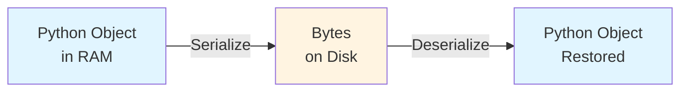
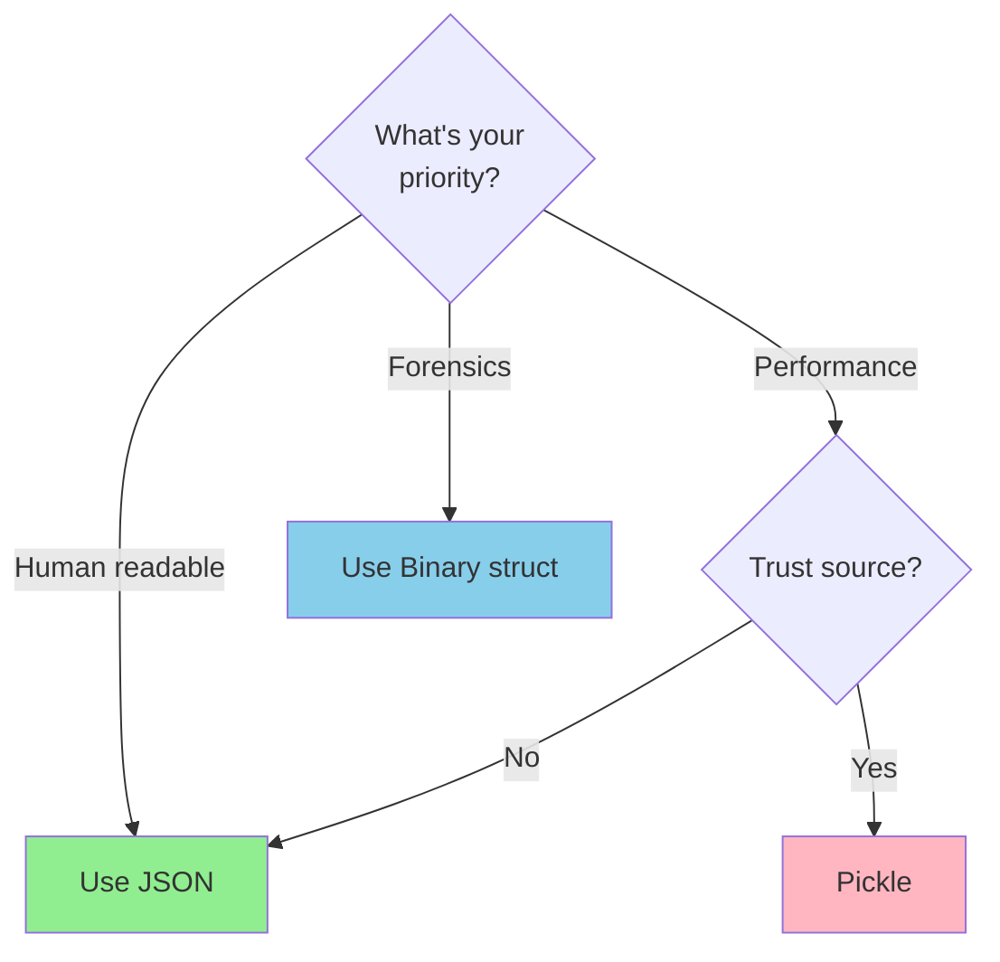

# Lab 03 Field Manual: Data Persistence & Serialization

This document provides the theoretical foundation for the Time Capsule investigation. Master these concepts before implementing the save system.

---

## 1. The Persistence Problem

### Volatile vs Non-Volatile Memory

**Volatile Memory (RAM):**
- Fast, temporary storage
- Lost when program ends or power is cut
- Where all Python variables live during execution

**Non-Volatile Memory (Disk):**
- Slower, permanent storage
- Survives program termination and power loss
- Where files live (HDD, SSD, USB drives)

### The Challenge

```python
# This character exists only in RAM
hero = Character("Aragorn", level=50)
hero.gold = 10000

# When the program ends... EVERYTHING IS LOST
# Next time we run the program, we start from scratch
```

**Solution:** **Serialization** - converting in-memory objects to a format that can be written to disk.

---

## 2. Serialization Fundamentals

### Definition

**Serialization:** The process of converting an object's state to a byte stream that can be:
- Written to disk
- Transmitted over a network
- Stored in a database

**Deserialization:** The reverse process—reconstructing the object from the byte stream.



### Why Multiple Formats?

Different use cases require different trade-offs:

| Use Case | Best Format |
|----------|-------------|
| Quick prototyping, debugging | Custom Text |
| Web APIs, cross-platform data | JSON |
| High-performance game saves | Binary (struct) |
| Quick Python-only prototypes | Pickle |

---

## 3. Format 1: Custom Text (Key=Value Pairs)

### The Simplest Approach

Before reaching for libraries like `json` or `struct`, it's worth understanding how to build a file format from scratch. A custom text format uses simple key=value pairs that are trivially human-readable and easy to debug.

### Format Structure

```
[CHARACTER]
name=Aragorn
level=50
health=5000
max_health=5000
mana=2500
max_mana=2500
position=42,17
gold=10000
experience=99999
[INVENTORY]
Sword
Shield
Potion
```

### Key Characteristics

| Aspect | Detail |
|--------|--------|
| Readability | Excellent — open in any text editor |
| Parsing | Manual — you write the parser yourself |
| Flexibility | Low — fragile if format changes |
| File Size | Largest (everything is text) |
| Cross-Language | Yes — any language can read text files |

### Implementation Pattern

```python
def save_text(self, filepath):
    """Save character to custom text format."""
    with open(filepath, 'w') as f:
        f.write("[CHARACTER]\n")
        f.write(f"name={self.name}\n")
        f.write(f"level={self.level}\n")
        f.write(f"health={self.health}\n")
        f.write(f"max_health={self.max_health}\n")
        f.write(f"mana={self.mana}\n")
        f.write(f"max_mana={self.max_mana}\n")
        f.write(f"position={self.position[0]},{self.position[1]}\n")
        f.write(f"gold={self.gold}\n")
        f.write(f"experience={self.experience}\n")
        f.write("[INVENTORY]\n")
        for item in self.inventory:
            f.write(f"{item}\n")
```

**Loading** requires manually parsing each line, splitting on `=`, and converting strings back to the correct types (e.g., `int("50")`, splitting `"42,17"` into a tuple). This is left as an exercise — see the lab notebook for guided hints.

### Why Start Here?

This format is a stepping stone. By writing both the save and load code yourself, you develop an intuition for what JSON and `struct` do automatically behind the scenes. It also demonstrates *why* standardized formats like JSON exist — they handle edge cases (special characters, nested structures) that a naive key=value parser does not.

---

## 4. Format 2: JSON (JavaScript Object Notation)

### What is JSON?

JSON is a lightweight, text-based data interchange format:

```json
{
  "name": "Aragorn",
  "level": 50,
  "position": [42, 17],
  "inventory": ["Sword", "Shield"],
  "active": true,
  "score": 99.5
}
```

### JSON Data Types

| JSON Type | Python Type | Example |
|-----------|-------------|---------|
| `null` | `None` | `null` |
| Boolean | `bool` | `true`, `false` |
| Number | `int`, `float` | `42`, `3.14` |
| String | `str` | `"hello"` |
| Array | `list` | `[1, 2, 3]` |
| Object | `dict` | `{"key": "value"}` |

**Important:** JSON does NOT support:
- Tuples (use lists instead)
- Sets (use lists instead)
- Custom classes (convert to dict)
- `bytes` (encode to string)

### Implementation Pattern

```python
import json

def save_json(self, filepath):
    """Save to JSON format."""
    data = {
        'character': {
            'name': self.name,
            'level': self.level,
            # ...
            'position': list(self.position),  # tuple → list
            'inventory': self.inventory.copy()
        }
    }

    with open(filepath, 'w', encoding='utf-8') as f:
        json.dump(data, f, indent=2)

@classmethod
def load_json(cls, filepath):
    """Load from JSON format."""
    with open(filepath, 'r', encoding='utf-8') as f:
        data = json.load(f)

    char_data = data['character']
    character = cls(char_data['name'], char_data['level'])
    # ...
    character.position = tuple(char_data['position'])  # list → tuple
    return character
```

---

## 5. Format 3: Binary (struct Module)

### The struct Module

Python's `struct` module packs/unpacks data into C-style binary formats. This is a critical forensic skill for reading files where you don't have field names.

### Format Strings

| Character | C Type | Python Type | Size (bytes) |
|-----------|--------|-------------|--------------|
| `i` | int | integer | 4 |
| `f` | float | float | 4 |
| `s` | char[] | bytes | varies |

### Binary Layout Design

**Fixed-Size Header:**
```
Offset  Size  Field
------  ----  -----
0       32    Name (null-padded string)
32      4     Level
36      4     Health
...     ...   ...
68      4     Inventory Count
72      ...   Variable-length inventory items
```

### Implementation Pattern

```python
import struct

def save_binary(self, filepath):
    with open(filepath, 'wb') as f:
        name_bytes = self.name.encode('utf-8')[:32].ljust(32, b'\x00')
        header = struct.pack('32s10i', name_bytes, self.level, ...)
        f.write(header)
        # Handle variable length inventory separately
```

**What this writes to disk — fixed 72-byte header:**

```
Byte offset   Size   Field
-----------   ----   -----
0             32     name        UTF-8 string, null-padded to exactly 32 bytes
32             4     level       signed int
36             4     health      signed int
40             4     max_health  signed int
44             4     mana        signed int
48             4     max_mana    signed int
52             4     position x  signed int
56             4     position y  signed int
60             4     gold        signed int
64             4     experience  signed int
68             4     inv_count   signed int  ← tells the reader how many items follow
72           ...     inventory   variable-length items written after the header
```

**Key details:**

- `'wb'` — binary mode is required; without `b`, Python silently corrupts the data on Windows by translating `\n` → `\r\n`
- `.encode('utf-8')[:32].ljust(32, b'\x00')` — three steps: convert `str` to `bytes`, truncate to 32, then null-pad to 32; `struct` requires `bytes` for the `s` format
- `struct.pack` returns a single `bytes` object of exactly 72 bytes — no separators, no newlines, values packed back-to-back
- Inventory is variable-length so it cannot fit in the fixed format string; the standard pattern is to write each item as a length-prefixed byte string after the header:

```python
        for item in self.inventory:
            item_bytes = item.encode('utf-8')
            f.write(struct.pack('i', len(item_bytes)))  # 4-byte length prefix
            f.write(item_bytes)                          # item data
```

---

## 6. Format 4: Pickle (Python Object Serialization)

Pickle is Python's native object serialization format. It can serialize almost any Python object with a single line of code.

### Implementation Pattern

```python
import pickle

def save_pickle(self, filepath):
    with open(filepath, 'wb') as f:
        pickle.dump(self, f)

@classmethod
def load_pickle(cls, filepath):
    with open(filepath, 'rb') as f:
        return pickle.load(f)
```

### Forensic Note

Although pickle files are binary, running `strings` on a `.pkl` file reveals Python class and attribute names embedded in the data. This makes pickle files partially readable to a forensic analyst — and it also hints at why they're dangerous: the file contains instructions for reconstructing arbitrary Python objects, including potentially malicious ones.

### ⚠️ CRITICAL SECURITY WARNING

**NEVER UNPICKLE UNTRUSTED DATA!**
Pickle can execute arbitrary code during deserialization. A malicious `.pkl` file could run system commands, delete files, or install malware when loaded. Only use pickle for files you created yourself.

---

## 7. Data Integrity: Checksums

### What is a Checksum?

A **checksum** (or hash) is a fixed-size value computed from data. Even a tiny change in the data produces a completely different checksum.

**Purpose:** Detect accidental corruption (file transfer errors, disk failures, incomplete writes).

### Implementation

The key insight is that the checksum must be computed on the character data *before* the checksum itself is added. Otherwise, adding the checksum changes the data, invalidating the checksum. The solution is a **wrapper pattern**: compute the hash on the inner data, then store both in an outer structure.

**Saving with checksum:**
```python
import hashlib
import json

def save_json_with_checksum(self, filepath):
    # 1. Build character data (no checksum here)
    char_data = {
        'name': self.name,
        'level': self.level,
        'health': self.health,
        'max_health': self.max_health,
        'mana': self.mana,
        'max_mana': self.max_mana,
        'position': list(self.position),
        'inventory': self.inventory.copy(),
        'gold': self.gold,
        'experience': self.experience
    }

    # 2. Compute checksum on the character data JSON string
    json_str = json.dumps(char_data, indent=2, sort_keys=True)
    checksum = hashlib.md5(json_str.encode('utf-8')).hexdigest()

    # 3. Wrap data + checksum together
    wrapper = {
        'checksum': checksum,
        'character': char_data
    }

    # 4. Write wrapper to file
    with open(filepath, 'w', encoding='utf-8') as f:
        json.dump(wrapper, f, indent=2)
```

**Loading with verification:**
```python
@classmethod
def load_json_with_checksum(cls, filepath):
    with open(filepath, 'r', encoding='utf-8') as f:
        wrapper = json.load(f)

    # Recompute checksum on the character data
    char_data = wrapper['character']
    json_str = json.dumps(char_data, indent=2, sort_keys=True)
    computed = hashlib.md5(json_str.encode('utf-8')).hexdigest()

    if computed != wrapper['checksum']:
        raise ValueError("Checksum mismatch! File may be corrupted.")

    # Reconstruct character from verified data
    character = cls(char_data['name'], char_data['level'])
    character.health = char_data['health']
    # ... restore remaining fields
    return character
```

---

## 8. Format Comparison Summary

### Decision Tree



### Quick Reference

| Scenario | Best Format |
|----------|-------------|
| Quick debugging / config files | Custom Text |
| Web API responses | JSON |
| High-performance game saves | Binary (struct) |
| Quick Python prototyping | Pickle (trusted only!) |
| Cross-platform game saves | JSON |
| Embedded systems | Binary (struct) |

---

## 9. Best Practices

1. **Always Use `with` Statements**: Ensures files are closed correctly.
2. **Validate Loaded Data**: Perform sanity checks (e.g., level should not be negative).
3. **Version Your Formats**: Include a `"version": "1.0"` field in your saves.
4. **Implement Backups**: Copy the old save before overwriting it.
5. **Use Checksums**: Always verify integrity for critical data.
