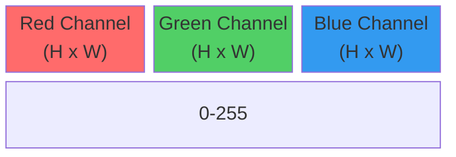
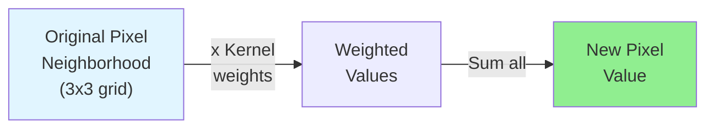
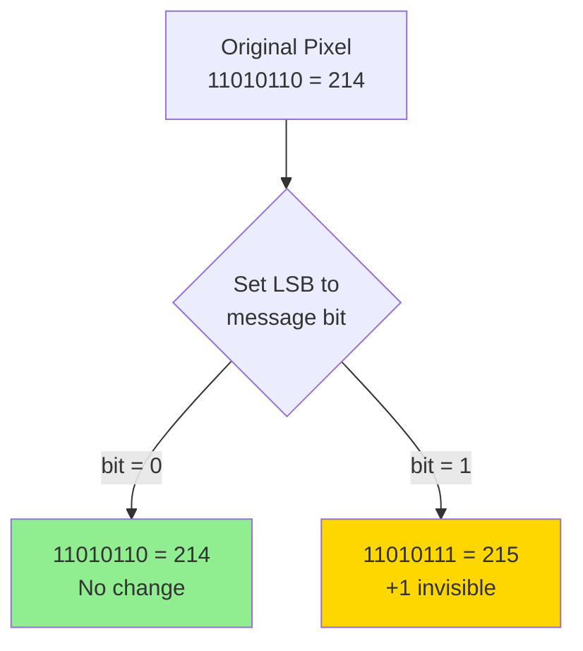
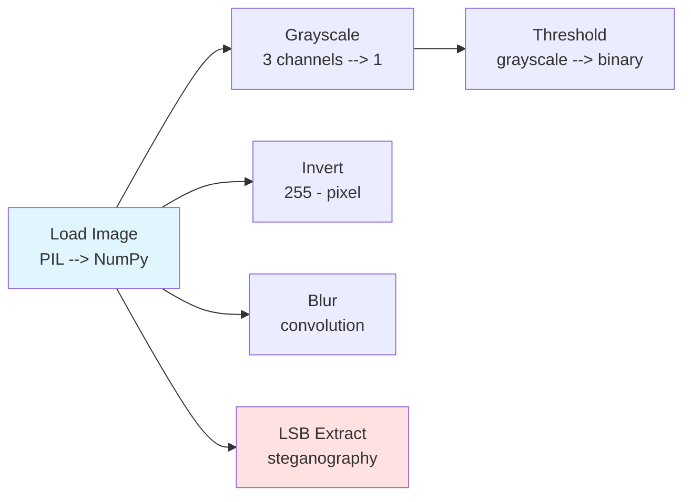

# Lab 04 Field Manual: Matrix Vision

**COMP3084 — Data Processing & Analysis**

This document is your technical reference for Lab 04. It covers the foundational
concepts you will need to understand before and during the lab exercises: NumPy
arrays, image representation, convolution (the math behind blur filters), binary
numbers, bitwise operations, and steganography. Refer back to this document
whenever you need to look up how something works.

---

## NumPy Fundamentals

NumPy is Python's standard library for numerical computing. Everything in this
lab is built on top of its core data structure: the **ndarray**.

### ndarray — The Core Data Structure

An **ndarray** (N-dimensional array) is a grid of values, all of the **same
type**, stored in a contiguous block of memory. Unlike Python lists, which can
hold mixed types and are stored as scattered objects, ndarrays are compact and
fast.

```python
import numpy as np

# A 1D array (vector)
a = np.array([10, 20, 30, 40])

# A 2D array (matrix)
b = np.array([[1, 2, 3],
              [4, 5, 6]])

# A 3D array (what an image looks like)
c = np.zeros((480, 640, 3), dtype=np.uint8)
```

### Shape

The **shape** of an array tells you its dimensions. For images:

- **Color image:** `(height, width, channels)` — e.g., `(300, 300, 3)` means
  300 pixels tall, 300 pixels wide, 3 color channels (Red, Green, Blue).
- **Grayscale image:** `(height, width)` — e.g., `(300, 300)` means 300x300
  pixels with a single intensity value each.

```python
from PIL import Image
import numpy as np

img = np.array(Image.open('data/surveillance_a.png'))
print(img.shape)  # (300, 300, 3) — height, width, channels
print(img.ndim)   # 3 — number of dimensions
```

<details>

<summary>Width vs Height Order</summary>

**Important — Width vs Height Order:**

There are **two competing conventions** and they cause endless confusion:
| Convention | Order | Example |
|------------|-------|---------|
| **Everyday / UI** | Width x Height | "1920x1080", "300x300 pixels" |
| **NumPy array** | (Height, Width) | `shape = (300, 300, 3)` → rows first, columns second |

The everyday convention matches mathematical **(x, y)** order — horizontal
first, then vertical. NumPy matches how you read a **2D table** — row first,
then column. In NumPy you index as `img[row, col]` or equivalently `img[y, x]`.
To make matters worse, even Python libraries disagree with each other:

| Library | Call | Returns |
|---------|------|---------|
| PIL/Pillow | `image.size` | `(width, height)` |
| PIL/Pillow | `np.array(image).shape` | `(height, width, channels)` |
| OpenCV | `image.shape` | `(height, width, channels)` |
| OpenCV | `cv2.resize(img, dsize=...)` | `dsize=(width, height)` |

**Rule of thumb:** If you are working with a NumPy array (which you will be
for this entire lab), shape is always **(height, width)**. If you are calling
a library function that asks for a "size", check the docs — it might expect
**(width, height)** instead.

</details>

### dtype

The **dtype** (data type) tells you what kind of number each element is. For
images, the standard dtype is:

- **`uint8`** — unsigned 8-bit integer, range **0 to 255**.

"Unsigned" means no negative values. "8-bit" means each value occupies exactly
one byte of memory. This is why pixel values go from 0 (black/none) to 255
(full intensity) — that is the range of an 8-bit unsigned integer (2^8 = 256
possible values).

```python
print(img.dtype)  # uint8
print(img.min())  # 0   (or close to it)
print(img.max())  # 255 (or close to it)
```

> **Warning — uint8 Overflow:**
> Arithmetic on uint8 values wraps around. If you add two uint8 values that
> exceed 255, the result wraps back to 0:
> ```python
> a = np.uint8(200)
> print(a + np.uint8(100))  # Output: 44 (NOT 300!)
> ```
> This is a common source of bugs. Always convert to `float64` before doing
> arithmetic, then clip and convert back:
> ```python
> result = img.astype(np.float64) * 1.5 + 30
> result = np.clip(result, 0, 255).astype(np.uint8)
> ```

### Broadcasting

**Broadcasting** is how NumPy applies operations between arrays of different
shapes. Instead of requiring you to manually loop through every element, NumPy
automatically "stretches" the smaller array to match the larger one.

Examples:

```python
# Scalar broadcast: multiply every pixel by 0.5
darkened = img * 0.5  # 0.5 is "broadcast" across all (300, 300, 3) elements

# 1D broadcast: different weight per channel
weights = np.array([0.2989, 0.5870, 0.1140])  # shape (3,)
gray = np.sum(img * weights, axis=2)            # (300,300,3) * (3,) works!

# 2D broadcast: add a per-row offset
offset = np.arange(300).reshape(300, 1)  # shape (300, 1)
shifted = img + offset                   # broadcasts across width and channels
```

The broadcasting rule: dimensions are compared from right to left. Two
dimensions are compatible if they are equal or if one of them is 1 (or missing).

### Vectorized Operations

A **vectorized operation** applies a function to an entire array at once, without
writing any Python `for` loop. Under the hood, NumPy executes the operation in
optimized C code, which is orders of magnitude faster than looping in Python.

```python
# SLOW — Python for-loop (do NOT do this for images)
result = np.zeros_like(img)
for y in range(img.shape[0]):
    for x in range(img.shape[1]):
        for c in range(img.shape[2]):
            result[y, x, c] = 255 - img[y, x, c]

# FAST — Vectorized (do THIS instead)
result = 255 - img
```

Both produce the same output, but the vectorized version runs roughly **100x
faster** on a typical image. The rule of thumb: if you are writing a `for` loop
over pixels, there is almost certainly a vectorized way to do it.

---

## Image Representation

Understanding how a digital image maps to a NumPy array is the foundation of
everything in this lab.

### Pixels

- A **color pixel** is a tuple of 3 values: `(Red, Green, Blue)`. Each value
  ranges from 0 (none of that color) to 255 (maximum intensity of that color).
  - `(255, 0, 0)` = pure red
  - `(0, 255, 0)` = pure green
  - `(0, 0, 255)` = pure blue
  - `(255, 255, 255)` = white (all channels at max)
  - `(0, 0, 0)` = black (all channels off)

- A **grayscale pixel** is a single value: 0 (black) to 255 (white). Values in
  between represent shades of gray.

### Images as Arrays

An image is a **2D grid of pixels**. Since each color pixel has 3 values, a
color image becomes a **3D NumPy array**:

```
image[row, column, channel]
      │    │       └── 0=Red, 1=Green, 2=Blue
      │    └── x-position (left to right)
      └── y-position (top to bottom)
```

```python
img = np.array(Image.open('data/surveillance_a.png'))
print(img.shape)         # (300, 300, 3)
print(img[0, 0])         # [R, G, B] values of the top-left pixel
print(img[0, 0, 0])      # Red value of the top-left pixel
print(img[:, :, 1])      # Entire Green channel as a 2D array
```


A 2×3 RGB image becomes a 2×3×3 NumPy array: the first two dimensions index
rows and columns (pixels), and the third dimension holds the three channel
values (R, G, B) for each pixel.

### Image-as-Array Structure



The three channels are stacked along the third axis (axis 2). When you slice
`img[:, :, 0]`, you get the entire Red channel as a 2D `(H, W)` array — which
looks like a grayscale image showing how much red is present at each pixel.

---

## Convolution — Sliding Window Math

Convolution sounds like an advanced math term, but in image processing it is
just a **sliding-window average** (or weighted average). If you can compute an
average of 9 numbers, you can understand convolution.

### What Is a Kernel?

A **kernel** (also called a **filter**) is a small grid of numbers, typically
3x3 or 5x5. Think of it as a "recipe" that tells you how to combine a pixel
with its neighbors to produce a new value.

**Example — 3x3 Box Blur kernel (the simplest case):**

```
  1/9  1/9  1/9
  1/9  1/9  1/9
  1/9  1/9  1/9
```

This says: "Replace each pixel with the average of itself and its 8 neighbors."

### How Convolution Works (Step-by-Step)

Imagine you have a 5x5 grayscale image and a 3x3 kernel:

```
Image (5x5):                 Kernel (3x3):
 10  20  30  40  50           1/9  1/9  1/9
 60  70  80  90 100           1/9  1/9  1/9
110 120 130 140 150           1/9  1/9  1/9
160 170 180 190 200
210 220 230 240 250
```

**Step 1:** Place the kernel centered on pixel (1,1) — value 70:

```
Neighborhood:        Multiply by kernel:        Sum:
 10  20  30          10/9  20/9  30/9
 60  70  80    -->   60/9  70/9  80/9    -->   (10+20+30+60+70+80+110+120+130) / 9
110 120 130         110/9 120/9 130/9           = 730 / 9 = 81 (approximately)
```

So pixel (1,1) becomes 81 (was 70 — now slightly brighter because neighbors
include larger values below it).

**Step 2:** Slide the kernel one pixel to the right, center it on pixel (1,2)
— value 80. Extract the 3x3 neighborhood around it, multiply element-wise by
the kernel, and sum. Repeat.

**Step 3:** Continue sliding across every pixel in the image until all pixels
have been processed.

### Convolution Flowchart



### Why Kernels Must Be Odd-Sized

A 3x3 kernel has a clear center pixel (1 pixel of padding on each side). A 4x4
kernel has no exact center, which makes alignment ambiguous. That is why kernels
are always odd-sized: **3x3, 5x5, 7x7**, and so on.

### What About Edge Pixels?

When the kernel is placed on a pixel at the edge of the image, part of the
kernel "hangs off" the edge and needs pixel values that do not exist. There are
several common solutions:

- **Zero-padding:** Pretend missing pixels are 0. Simple, but causes dark
  borders in the output.
- **Reflect-padding:** Mirror the image at the edges. Produces the best visual
  results and is the approach used in this lab.
- **Replicate-padding:** Copy the nearest edge pixel outward.

```python
# In NumPy, reflect-padding a 2D image by 1 pixel on each side:
padded = np.pad(img, pad_width=1, mode='reflect')
```

### Different Kernels = Different Effects

The kernel values determine what the convolution does. Here are three common
kernels and their effects:

| Kernel | Effect | Example Values (3x3) |
|--------|--------|----------------------|
| **Box Blur** | Smooths / blurs the image | All values equal: `1/9` |
| **Sharpen** | Enhances edges and detail | Center = 5, neighbors = -1 |
| **Edge Detect** | Highlights boundaries between regions | Mix of +1 and -1 values |

The box blur kernel (all equal weights) is the one you must implement in this
lab. Sharpen and edge detection are bonus challenges.

```python
# Box blur kernel (3x3)
blur_kernel = np.ones((3, 3)) / 9

# Sharpen kernel
sharpen_kernel = np.array([[ 0, -1,  0],
                           [-1,  5, -1],
                           [ 0, -1,  0]])

# Edge detection kernel (Laplacian)
edge_kernel = np.array([[-1, -1, -1],
                        [-1,  8, -1],
                        [-1, -1, -1]])
```

---

## Binary Numbers — A Gentle Primer

No advanced math is required here — just counting in a different base system,
similar to how hexadecimal was base-16 in Lab 02. Binary is base-2.

### Why Binary Matters for Images

Every pixel value (0-255) is stored in the computer as **8 binary digits
(bits)**. To hide secret data inside an image, we need to read and write
individual bits. That requires understanding how numbers look in binary and how
to manipulate specific bits.

### Counting in Binary (Base-2)

In decimal (base-10), each digit position is a power of 10:

```
  Decimal 214 = 2 x 100  +  1 x 10  +  4 x 1
              = 2 x 10^2 +  1 x 10^1 +  4 x 10^0
```

In binary (base-2), each digit position is a power of 2:

```
  Position:    7     6     5     4     3     2     1     0
  Power of 2:  128   64    32    16    8     4     2     1
  ----------------------------------------------------------------
  Binary:      1     1     0     1     0     1     1     0
  Value:       128 + 64  + 0   + 16  + 0   + 4   + 2   + 0  = 214
```

So `214` in decimal = `11010110` in binary.

### Key Vocabulary

- **Bit:** A single binary digit (0 or 1). The smallest unit of data.
- **Byte:** 8 bits. Can represent values 0-255 (2^8 = 256 possible values).
- **MSB (Most Significant Bit):** The leftmost bit (position 7) — worth 128.
  Changing it has a large effect on the value.
- **LSB (Least Significant Bit):** The rightmost bit (position 0) — worth only
  1. Changing it has a negligible effect on the value.

### Python Binary Conversion Practice

```python
# Decimal to Binary string
bin(214)            # '0b11010110'
format(214, '08b')  # '11010110' (8 digits, zero-padded)

# Binary to Decimal
int('11010110', 2)  # 214

# Quick reference table
for v in [0, 1, 127, 128, 200, 255]:
    print(f"  {v:3d} = {v:08b}")
#   0 = 00000000
#   1 = 00000001
# 127 = 01111111
# 128 = 10000000
# 200 = 11001000
# 255 = 11111111
```

### The LSB Insight

Changing the **MSB** (bit 7) changes the value by **128** — very noticeable in
an image.

Changing the **LSB** (bit 0) changes the value by only **1** — completely
invisible to the human eye.

```
Original:  11010110 = 214   <-- A specific shade of red
Modified:  11010111 = 215   <-- LSB flipped from 0 to 1
Difference: 1 out of 255    <-- 0.4% change — INVISIBLE
```

This is the core idea behind steganography: the LSB is "free real estate" for
hiding data.

---

## Bitwise Operations — The Toolkit

Bitwise operators work on individual bits of a number. Think of them as tools
that let you inspect, set, or clear specific bits without affecting the others.

No math beyond basic arithmetic is needed — each operation is just a rule
applied to pairs of bits (0s and 1s).

### 1. AND (`&`) — "Masking" / Extracting Bits

**The rule:** `1 & 1 = 1`, everything else = 0. Like a filter that only lets
through positions where *both* inputs are 1.

```
  11010110   (214)
& 00000001   (1)       <-- "mask" -- only bit 0 is 1
----------
  00000000   --> Result: 0   (the LSB of 214 is 0)

  11010111   (215)
& 00000001   (1)
----------
  00000001   --> Result: 1   (the LSB of 215 is 1)
```

**Use case:** `pixel & 1` extracts the LSB — tells us if the pixel is hiding a
0 or a 1.

```python
# Python example
print(214 & 1)  # 0
print(215 & 1)  # 1
```

### 2. OR (`|`) — "Setting" Bits

**The rule:** `0 | 0 = 0`, everything else = 1. If *either* input is 1, the
result is 1.

```
  11010110   (214)
| 00000001   (1)
----------
  11010111   --> Result: 215  (LSB is now guaranteed to be 1)
```

**Use case:** `pixel | 1` forces the LSB to 1 (without changing any other bit).

```python
# Python example
print(214 | 1)  # 215
print(215 | 1)  # 215 (already had LSB = 1, no change)
```

### 3. Combined: Clear-then-Set Pattern

To set the LSB to a *specific* value (0 or 1), use a two-step pattern:

```python
# Step 1: Clear the LSB (set it to 0)
cleared = pixel & 0xFE    # 0xFE = 11111110 -- keeps all bits EXCEPT bit 0

# Step 2: Set the LSB to our desired bit value
result = cleared | bit    # bit is 0 or 1
```

**Worked example — hiding a `1` in pixel value 214:**

```
  Step 1:  11010110 & 11111110 = 11010110  (LSB was already 0, stays 0)
  Step 2:  11010110 | 00000001 = 11010111  (LSB set to 1 --> value becomes 215)
```

**Worked example — hiding a `0` in pixel value 215:**

```
  Step 1:  11010111 & 11111110 = 11010110  (LSB cleared to 0)
  Step 2:  11010110 | 00000000 = 11010110  (LSB stays 0 --> value becomes 214)
```

This "clear-then-set" pattern is the fundamental building block of LSB
steganography. In a single line of Python:

```python
new_pixel = (pixel & 0xFE) | bit
```

### 4. Left Shift (`<<`) — Multiplying by Powers of 2

Shifts all bits to the left by N positions, filling with zeros on the right.

```
  00000001 << 3 = 00001000   (1 x 2^3 = 8)
  00000011 << 1 = 00000110   (3 x 2^1 = 6)
```

**Use case:** Building a number from individual bits, one at a time.

Here is how you reconstruct the letter 'H' (ASCII 72) from 8 bits:

```python
# The bits of 'H': 0, 1, 0, 0, 1, 0, 0, 0
bits = [0, 1, 0, 0, 1, 0, 0, 0]
value = 0
for bit in bits:
    value = (value << 1) | bit   # Shift left, add new bit on the right
    # Round 1: value = 0  --> shift --> 0,  OR 0 --> 0
    # Round 2: value = 0  --> shift --> 0,  OR 1 --> 1
    # Round 3: value = 1  --> shift --> 2,  OR 0 --> 2
    # Round 4: value = 2  --> shift --> 4,  OR 0 --> 4
    # Round 5: value = 4  --> shift --> 8,  OR 1 --> 9
    # Round 6: value = 9  --> shift --> 18, OR 0 --> 18
    # Round 7: value = 18 --> shift --> 36, OR 0 --> 36
    # Round 8: value = 36 --> shift --> 72, OR 0 --> 72

print(value)      # 72
print(chr(value))  # 'H'
```

This `(value << 1) | bit` pattern is exactly what you will use in the
steganography decoder to reassemble characters from extracted LSBs.

### 5. Right Shift (`>>`) — Dividing by Powers of 2

Shifts all bits to the right, discarding bits that fall off the end.

```
  11010110 >> 1 = 01101011   (214 / 2 = 107)
  11010110 >> 4 = 00001101   (214 / 16 = 13)
```

**Use case:** Extracting a specific bit from a number:

```python
# Get the bit at position 3 of value 214
(214 >> 3) & 1   # Shift bit 3 into position 0, then mask with AND
# 11010110 >> 3 = 00011010, then & 1 = 0
```

This is useful in the encoder, where you need to break a character into
individual bits to embed them one at a time.

---

## Putting It All Together: The Steganography Recipe

Here is how all the bitwise operations combine for steganography, shown
step-by-step with no math beyond what was covered above.

### Hiding the Letter 'H' in 8 Pixels

The letter 'H' has ASCII value 72, which in binary is `01001000`. To hide it,
we need 8 pixels — one for each bit:

```
Character 'H' = ASCII 72 = binary 01001000

Pixel #0:  value 200 (11001000), hide bit 0 --> (200 & 0xFE) | 0 = 200
Pixel #1:  value 150 (10010110), hide bit 1 --> (150 & 0xFE) | 1 = 151
Pixel #2:  value 180 (10110100), hide bit 0 --> (180 & 0xFE) | 0 = 180
Pixel #3:  value 90  (01011010), hide bit 0 --> (90  & 0xFE) | 0 = 90
Pixel #4:  value 220 (11011100), hide bit 1 --> (220 & 0xFE) | 1 = 221
Pixel #5:  value 130 (10000010), hide bit 0 --> (130 & 0xFE) | 0 = 130
Pixel #6:  value 175 (10101111), hide bit 0 --> (175 & 0xFE) | 0 = 174
Pixel #7:  value 100 (01100100), hide bit 0 --> (100 & 0xFE) | 0 = 100

Maximum change to any pixel: +/- 1.  Invisible to the human eye.
```

### Reading 'H' Back from Those 8 Pixels

```python
pixels = [200, 151, 180, 90, 221, 130, 174, 100]
bits = [p & 1 for p in pixels]   # [0, 1, 0, 0, 1, 0, 0, 0]
value = 0
for bit in bits:
    value = (value << 1) | bit   # Build number bit by bit
# value = 72, chr(72) = 'H'
```

This is the complete cycle: encode by clearing-and-setting LSBs, decode by
extracting LSBs and shifting them together.

---

## Steganography

### Definition

**Steganography** is the practice of hiding data within an ordinary-looking
carrier — such as an image, audio file, or video — so that the existence of the
hidden data is not apparent to a casual observer. Unlike encryption, which makes
data unreadable, steganography makes data *invisible*.

### LSB Method

The **Least Significant Bit (LSB) method** replaces the lowest bit of each
pixel value with a bit of the secret message. Because the LSB contributes only
1 to the pixel value (out of a range of 0-255), the visual change is
imperceptible:

```
Original pixel:  11010110  (214)
Modified pixel:  11010111  (215)  <-- LSB changed from 0 to 1
Difference: INVISIBLE to the human eye
```

### Capacity Formula

An image can hide a limited amount of data. The capacity depends on how many
pixel values are available:

```
Capacity (in bytes) = (Width x Height x Channels) / 8
```

For example, a 100x100 image with 3 channels (RGB):
- Total pixel values: 100 x 100 x 3 = 30,000
- Each pixel value hides 1 bit
- Total hidden capacity: 30,000 / 8 = **3,750 bytes** of text

If you use only one channel (such as the Red channel, as in this lab):
- Total pixel values: 100 x 100 x 1 = 10,000
- Total hidden capacity: 10,000 / 8 = **1,250 bytes**

### Detection

Steganography is not foolproof. **Steganalysis** techniques can detect hidden
data by examining statistical properties of the image:

- A "clean" photograph has quasi-random LSB distributions.
- An image carrying hidden data may show unusual patterns in its LSB layer.
- Specialized forensic tools analyze the frequency distribution of pixel values
  to detect anomalies.

You can visualize the LSB layer of an image to get a sense of this:

```python
# Extract and visualize the LSB layer
lsb_layer = img & 1             # Bitwise AND with 1: gets LSB of every pixel
lsb_visual = (lsb_layer * 255).astype(np.uint8)  # Scale to visible range

import matplotlib.pyplot as plt
plt.imshow(lsb_visual, cmap='gray')
plt.title("LSB Layer (Enhanced)")
plt.show()
```

In a normal photograph, the LSB layer looks like random noise. In an image with
a hidden message, you may notice structured patterns in the area where the
message was written.

### LSB Encoding Scheme



---

## Filter Pipeline Overview

The following diagram shows how the image flows through the different processing
paths in this lab. You start by loading the image as a NumPy array, then apply
various filters or extract hidden data:



Each arrow represents a function you will implement. The grayscale conversion
feeds into thresholding (since thresholding requires a single-channel input),
while inversion, blur, and steganography all operate on the original color
image.

---

## Quick Reference Summary

| Concept | Key Point |
|---------|-----------|
| **ndarray** | N-dimensional array; the core NumPy data structure |
| **Shape** | `(H, W, 3)` for color, `(H, W)` for grayscale |
| **dtype** | `uint8` for images: unsigned 8-bit, range 0-255 |
| **Broadcasting** | NumPy stretches smaller arrays to match larger ones |
| **Vectorized ops** | Array math is ~100x faster than Python for-loops |
| **Convolution** | Slide a kernel over the image, multiply-and-sum at each position |
| **Kernel** | Small grid of weights (must be odd-sized: 3x3, 5x5, ...) |
| **Padding** | Handles edge pixels; reflect-padding gives best results |
| **LSB** | Least Significant Bit — worth only 1; invisible when changed |
| **MSB** | Most Significant Bit — worth 128; very visible when changed |
| **AND (`&`)** | Extracts bits (masking): `pixel & 1` gets the LSB |
| **OR (`\|`)** | Sets bits: `pixel \| 1` forces LSB to 1 |
| **Clear-then-Set** | `(pixel & 0xFE) \| bit` sets LSB to a specific value |
| **Left Shift (`<<`)** | Builds a number from bits: `(value << 1) \| bit` |
| **Right Shift (`>>`)** | Extracts a specific bit: `(value >> n) & 1` |
| **Steganography** | Hiding data in LSBs of pixel values; invisible to the eye |
| **Capacity** | `W x H x Channels / 8` bytes of hidden data |
