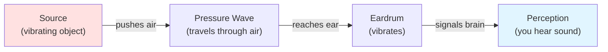
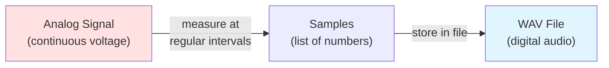
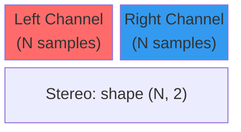
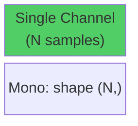
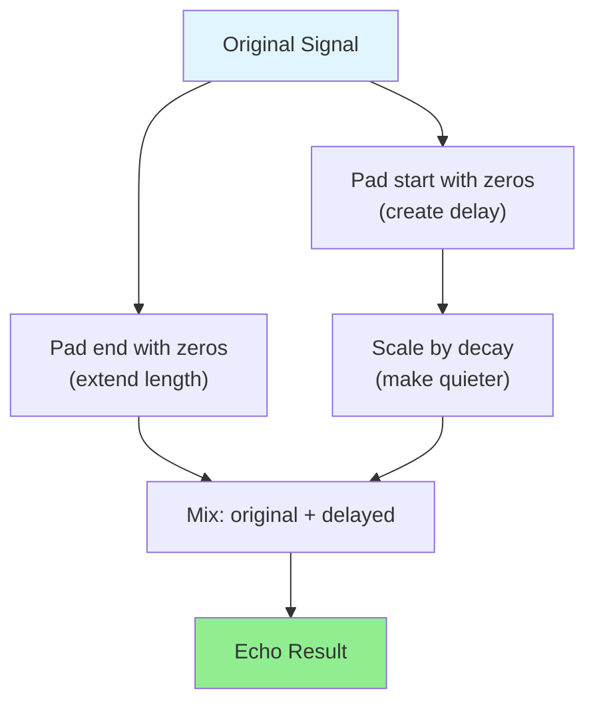
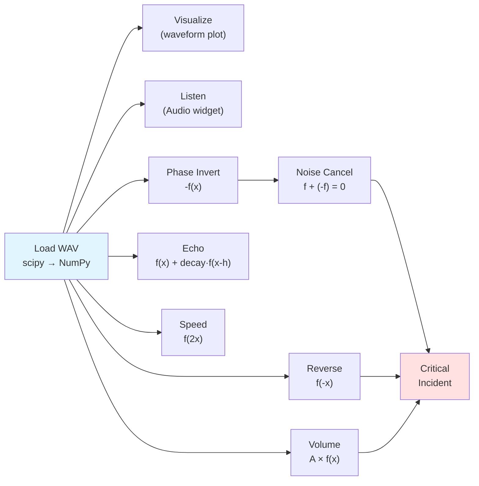

# Lab 05 Field Manual: Digital Waves

**COMP3084 — Data Processing & Analysis**

This document is your technical reference for Lab 05. It covers the foundational
concepts you will need to understand before and during the lab exercises: how
sound works physically, how it is stored digitally, the `int16` data type and
its overflow traps, and how every audio effect you will build maps to a
**Precalculus function transformation** you already know. Refer back to this
document whenever you need to look up how something works.

---

## How Sound Works

### Sound Is Vibration

When you pluck a guitar string, it vibrates back and forth. Those vibrations
push and pull the air molecules around it, creating waves of higher and lower
air pressure that travel outward. When these pressure waves reach your ear,
your eardrum vibrates in response, and your brain interprets those vibrations
as sound.



### Amplitude and Frequency

Two properties define a sound wave:

- **Amplitude** — how far the air pressure swings from rest. Higher amplitude
  = louder sound. Think of it as the *height* of the wave.
- **Frequency** — how many complete vibrations happen per second, measured in
  **Hertz (Hz)**. Higher frequency = higher pitch.
  - A bass guitar note might be 80 Hz (80 vibrations per second).
  - A whistle might be 2000 Hz.
  - Human hearing range: roughly 20 Hz to 20,000 Hz.

### Wavelength

**Wavelength** is the physical distance between two consecutive peaks of a
wave. It is inversely related to frequency:

```
wavelength = speed_of_sound / frequency
```

At room temperature, sound travels at roughly 343 m/s:
- A 220 Hz note has a wavelength of 343 / 220 ≈ **1.56 meters**
- A 440 Hz note (one octave higher) has a wavelength of 343 / 440 ≈ **0.78 meters**

You do not need to calculate wavelengths in this lab, but understanding the
relationship helps explain why higher-frequency sounds seem "smaller" and
lower-frequency sounds seem "bigger."

### Visualizing a Wave

The following code generates an annotated plot of a pure sine wave, labeling
amplitude, frequency, and wavelength:

```python
import numpy as np
import matplotlib.pyplot as plt

# Generate a 220 Hz sine wave (1 cycle takes 1/220 ≈ 0.00454 seconds)
freq = 220  # Hz
duration = 2 / freq  # Show exactly 2 complete cycles
rate = 44100  # samples per second (CD quality)
t = np.linspace(0, duration, int(rate * duration), endpoint=False)
wave = np.sin(2 * np.pi * freq * t)

fig, ax = plt.subplots(figsize=(10, 4))
ax.plot(t * 1000, wave, color='steelblue', linewidth=2)  # time in milliseconds
ax.axhline(y=0, color='gray', linestyle='--', linewidth=0.5)

# Annotate amplitude
ax.annotate('', xy=(0.2, 1.0), xytext=(0.2, 0),
            arrowprops=dict(arrowstyle='<->', color='crimson', lw=2))
ax.text(0.5, 0.5, 'Amplitude', color='crimson', fontsize=12, fontweight='bold')

# Annotate one wavelength (period in time)
period_ms = 1000 / freq  # one cycle in milliseconds
ax.annotate('', xy=(0, -1.15), xytext=(period_ms, -1.15),
            arrowprops=dict(arrowstyle='<->', color='green', lw=2))
ax.text(period_ms / 2, -1.35, f'Period = 1/{freq} s ≈ {period_ms:.1f} ms',
        color='green', fontsize=11, ha='center', fontweight='bold')

ax.set_xlabel('Time (milliseconds)')
ax.set_ylabel('Amplitude')
ax.set_title(f'Pure Sine Wave — {freq} Hz')
ax.set_ylim(-1.5, 1.3)
plt.tight_layout()
plt.show()
```

---

## From Physical Wave to Digital Array

### The Microphone: Air Pressure → Voltage

A microphone converts air pressure variations into an electrical voltage that
fluctuates in the same pattern as the sound wave. This continuous, smooth
voltage signal is called an **analog signal**.

### Sampling: Continuous → Discrete

A computer cannot store a continuous signal — it would require infinite data.
Instead, a device called an **Analog-to-Digital Converter (ADC)** measures the
voltage at regular intervals and records each measurement as a number. This
process is called **sampling**.



### Sample Rate

The **sample rate** is how many measurements (samples) are taken per second,
measured in Hz. Common sample rates:

| Sample Rate | Quality | Use Case |
|-------------|---------|----------|
| 8,000 Hz | Telephone | Voice calls |
| 16,000 Hz | Wideband speech | Speech recognition, this lab |
| 44,100 Hz | CD quality | Music |
| 48,000 Hz | Professional | Film, broadcast |

A sample rate of 16,000 Hz means the signal is measured 16,000 times per
second. A 3.5-second recording at 16,000 Hz contains 56,000 samples — that
is the length of your NumPy array.

### Visualizing Sampling

This plot shows how a continuous wave (blue) is captured as discrete sample
points (red dots). More samples = more accurate representation:

```python
import numpy as np
import matplotlib.pyplot as plt

freq = 5  # Hz (slow wave for visibility)
duration = 1.0

# "Continuous" signal (very high resolution)
t_cont = np.linspace(0, duration, 10000)
y_cont = np.sin(2 * np.pi * freq * t_cont)

fig, axes = plt.subplots(1, 2, figsize=(14, 4))

for ax, n_samples, title in zip(axes, [15, 60],
    ['Low Sample Rate (15 samples/sec)', 'Higher Sample Rate (60 samples/sec)']):
    t_samp = np.linspace(0, duration, n_samples, endpoint=False)
    y_samp = np.sin(2 * np.pi * freq * t_samp)

    ax.plot(t_cont, y_cont, color='steelblue', linewidth=1.5, alpha=0.5,
            label='Continuous signal')
    ax.stem(t_samp, y_samp, linefmt='r-', markerfmt='ro', basefmt='gray',
            label=f'{n_samples} samples')
    ax.set_xlabel('Time (seconds)')
    ax.set_ylabel('Amplitude')
    ax.set_title(title)
    ax.legend(fontsize=9)
    ax.axhline(y=0, color='gray', linestyle='--', linewidth=0.5)

plt.tight_layout()
plt.show()
```

**Key observation:** With too few samples, the wave shape is lost. With enough
samples, the discrete points accurately trace the original curve. The rule of
thumb (Nyquist theorem) is that you need **at least 2 samples per cycle** of
the highest frequency you want to capture.

---

## Sound as a NumPy Array

### Loading a WAV File

The `scipy.io.wavfile` module reads the binary WAV header for you and returns
the audio data as a NumPy array:

```python
from scipy.io import wavfile

rate, data = wavfile.read('data/stereo_sample.wav')
print(f"Sample Rate: {rate} Hz")       # e.g., 16000
print(f"Shape: {data.shape}")          # (N,) for mono, (N, 2) for stereo
print(f"Dtype: {data.dtype}")          # int16
print(f"Duration: {len(data) / rate:.2f} seconds")
```

### Mono vs Stereo

| Type | Array Shape | Description |
|------|-------------|-------------|
| **Mono** | `(N,)` | One channel — a single 1D list of amplitudes |
| **Stereo** | `(N, 2)` | Two channels — column 0 is Left, column 1 is Right |

```python
# Stereo: shape (N, 2)
left_channel  = data[:, 0]   # 1D array of left speaker values
right_channel = data[:, 1]   # 1D array of right speaker values

# Convert to mono by averaging
mono = ((data[:, 0].astype(np.float64) + data[:, 1].astype(np.float64)) / 2).astype(np.int16)
```

### Stereo vs Mono Structure





### Duration Formula

```
duration_seconds = number_of_samples / sample_rate
```

For example: 56,000 samples at 16,000 Hz = **3.5 seconds**.

To convert a time in seconds to a sample index:

```
sample_index = int(time_seconds * sample_rate)
```

---

## The int16 Data Type

### Range and Representation

WAV audio data is typically stored as **`int16`** — a signed 16-bit integer:

| Property | Value |
|----------|-------|
| Bits | 16 |
| Signed | Yes (positive and negative values) |
| Minimum | -32,768 |
| Maximum | +32,767 |
| Total values | 65,536 (2^16) |

The sign matters because sound waves oscillate *above and below* a resting
position (zero). Positive values represent air pushed forward; negative values
represent air pulled back.

```
Maximum positive:  +32,767 = 0111111111111111
Zero (silence):          0 = 0000000000000000
Maximum negative:  -32,768 = 1000000000000000
```

### Comparing int16 to Lab 04's uint8

| Property | Lab 04 (Images) | Lab 05 (Audio) |
|----------|-----------------|----------------|
| Data type | `uint8` | `int16` |
| Range | 0 to 255 | -32,768 to +32,767 |
| Signed? | No (unsigned) | Yes (signed) |
| Overflow example | `200 + 100 = 44` | `20000 × 2 = -25536` |
| Fix | Cast to `float64`, clip to [0, 255] | Cast to `float64`, clip to [-32768, 32767] |

### int16 Overflow — The Same Trap, Different Numbers

Just like `uint8` in Lab 04, `int16` arithmetic wraps around silently:

```python
import numpy as np

a = np.int16(20000)
b = np.int16(20000)
print(a + b)   # -25536, NOT 40000!

c = np.int16(20000)
print(c * np.int16(2))   # -25536 again!
```

**Why:** `int16` can only hold values up to +32,767. When the result exceeds
that, it wraps around into negative territory. This is **silent** — no error
is raised, and the corrupted value is stored as if nothing happened.

**The fix is always the same pattern:**

```python
# SAFE: convert to float, do math, clip, cast back
result = data.astype(np.float64) * 2.0
result = np.clip(result, -32768, 32767)
result = result.astype(np.int16)
```

### What Overflow Sounds Like

If you multiply audio by 2 without protecting against overflow, the peaks of
the waveform wrap to the opposite extreme, creating harsh distortion called
**clipping**. Visually, the smooth wave tops are "chopped off" and replaced
with jagged spikes.

```python
import numpy as np
import matplotlib.pyplot as plt

# Generate a loud sine wave
rate = 16000
t = np.arange(rate) / rate  # 1 second
clean = (np.sin(2 * np.pi * 440 * t) * 20000).astype(np.int16)

# Overflow: multiply int16 directly (wraps around!)
overflowed = clean * np.int16(2)

# Safe: multiply as float, clip, cast
safe = np.clip(clean.astype(np.float64) * 2, -32768, 32767).astype(np.int16)

fig, axes = plt.subplots(3, 1, figsize=(12, 7), sharex=True)
window = int(0.01 * rate)  # 10ms

axes[0].plot(np.arange(window) / rate * 1000, clean[:window], color='steelblue')
axes[0].set_title('Original (peak = 20,000)')

axes[1].plot(np.arange(window) / rate * 1000, overflowed[:window], color='crimson')
axes[1].set_title('Overflowed: int16(20000) × 2 = -25536 (WRONG!)')

axes[2].plot(np.arange(window) / rate * 1000, safe[:window], color='green')
axes[2].set_title('Safe: float64 → clip → int16 (clipped at ±32767)')

for ax in axes:
    ax.set_ylabel('Amplitude')
    ax.axhline(y=0, color='gray', linestyle='--', linewidth=0.5)
axes[-1].set_xlabel('Time (milliseconds)')
plt.tight_layout()
plt.show()
```

---

## Waveform Visualization

### Plotting Audio

The standard way to visualize sound is a **waveform plot**: amplitude (y-axis)
vs. time in seconds (x-axis).

```python
import numpy as np
import matplotlib.pyplot as plt
from scipy.io import wavfile

rate, data = wavfile.read('data/stereo_sample.wav')
# Convert to mono if stereo
if data.ndim == 2:
    data = ((data[:, 0].astype(np.float64) + data[:, 1].astype(np.float64)) / 2).astype(np.int16)

time_axis = np.arange(len(data)) / rate  # Convert sample index → seconds

fig, ax = plt.subplots(figsize=(12, 4))
ax.plot(time_axis, data, linewidth=0.5, color='steelblue')
ax.set_xlabel('Time (seconds)')
ax.set_ylabel('Amplitude')
ax.set_title('Waveform')
ax.axhline(y=0, color='gray', linestyle='--', linewidth=0.5)
plt.tight_layout()
plt.show()
```

### Zoomed / Windowed View

To see individual oscillations, plot a small window (e.g., 10 ms):

```python
window_ms = 10  # milliseconds
window_samples = int(window_ms / 1000 * rate)

fig, ax = plt.subplots(figsize=(12, 4))
t = np.arange(window_samples) / rate * 1000  # time in ms
ax.plot(t, data[:window_samples], linewidth=1.0, color='steelblue', marker='.',
        markersize=3)
ax.set_xlabel('Time (milliseconds)')
ax.set_ylabel('Amplitude')
ax.set_title(f'Zoomed View: First {window_ms} ms')
ax.axhline(y=0, color='gray', linestyle='--', linewidth=0.5)
plt.tight_layout()
plt.show()
```

### Waveform Color Conventions

Throughout this lab, waveform plots use consistent colors for clarity:

| Signal Type | Color | Matplotlib Name |
|-------------|-------|-----------------|
| Original | Blue | `steelblue` |
| Inverted / Noise | Red | `crimson` |
| Cleaned / Result | Green | `green` |
| Echo / Reverb | Orange | `darkorange` |
| Reversed | Purple | `purple` |

### Listening to Audio

`IPython.display.Audio` renders an HTML5 audio player directly in the
notebook — with play/pause, seek, and time display:

```python
from IPython.display import Audio, display

# From NumPy array (always specify rate!)
display(Audio(data=data, rate=rate))

# For stereo data (shape N, 2), transpose: Audio expects (channels, N)
display(Audio(data=stereo_data.T, rate=rate))
```

---

## Audio Effects as Function Transformations

This is the key bridge between the math you already know and the audio
processing you will implement. Every effect corresponds to a function
transformation from Precalculus.

### Reference: Function Transformation Rules

If $f(x)$ is your original function (the sound waveform), these transformations
produce predictable changes:

| Transformation | Formula | Effect on Graph | Effect on Sound |
|----------------|---------|-----------------|-----------------|
| **Vertical Stretch** | $A \cdot f(x), \quad A > 1$ | Wave gets taller | Louder |
| **Vertical Compression** | $A \cdot f(x), \quad 0 < A < 1$ | Wave gets shorter | Quieter |
| **Reflection (x-axis)** | $-f(x)$ | Wave flips upside down | Sounds the same! |
| **Vertical Shift** | $f(x) + k$ | Wave moves up/down | DC offset (bad) |
| **Horizontal Shift** | $f(x - h)$ | Wave moves right by $h$ | Delayed copy |
| **Horizontal Reflection** | $f(-x)$ | Wave reads right-to-left | Reversed playback |
| **Horizontal Compression** | $f(2x)$ | Wave squeezes together | Faster + higher pitch |
| **Horizontal Stretch** | $f(x/2)$ | Wave spreads apart | Slower + lower pitch |

### Visualizing the Transformations

The following code generates a reference plot showing how each transformation
affects a simple waveform:

```python
import numpy as np
import matplotlib.pyplot as plt

# Original: a short tone burst
rate = 1000  # low rate for clear visualization
t = np.arange(200) / rate
original = np.sin(2 * np.pi * 10 * t)  # 10 Hz for visibility

fig, axes = plt.subplots(3, 2, figsize=(14, 10))

# Original
axes[0, 0].plot(t, original, color='steelblue', linewidth=2)
axes[0, 0].set_title('Original: f(x)')

# Vertical Stretch (Volume Up)
axes[0, 1].plot(t, original * 2, color='darkorange', linewidth=2)
axes[0, 1].set_title('Volume Up: 2 · f(x)')

# Vertical Compression (Volume Down)
axes[1, 0].plot(t, original * 0.3, color='darkorange', linewidth=2)
axes[1, 0].set_title('Volume Down: 0.3 · f(x)')

# Reflection over x-axis (Phase Inversion)
axes[1, 1].plot(t, -original, color='crimson', linewidth=2)
axes[1, 1].set_title('Phase Inversion: -f(x)')

# Horizontal Reflection (Reversal)
axes[2, 0].plot(t, original[::-1], color='purple', linewidth=2)
axes[2, 0].set_title('Reversal: f(-x)')

# Horizontal Compression (Speed Up)
fast_t = t[:100]
fast_y = np.sin(2 * np.pi * 10 * fast_t * 2)
axes[2, 1].plot(fast_t, fast_y, color='green', linewidth=2)
axes[2, 1].set_title('Speed Up: f(2x) — same time, double frequency')

for ax in axes.flat:
    ax.set_ylim(-2.5, 2.5)
    ax.axhline(y=0, color='gray', linestyle='--', linewidth=0.5)
    ax.set_xlabel('Time (s)')
    ax.set_ylabel('Amplitude')

plt.tight_layout()
plt.show()
```

---

## Volume Control — Vertical Scaling

### The Math

```
louder[i]  = factor × data[i],    where factor > 1
quieter[i] = factor × data[i],    where 0 < factor < 1
```

In NumPy, this is a single vectorized operation:

```python
louder = data * 2.0    # Broadcasting: 2.0 is applied to every sample
quieter = data * 0.3
```

### Overflow Protection

Always use the safe pattern:

```python
def adjust_volume(data, factor):
    result = data.astype(np.float64) * factor
    result = np.clip(result, -32768, 32767)
    return result.astype(np.int16)
```

### Why Clipping Sounds Bad

When a wave is too loud and gets clipped at ±32,767, the smooth peaks become
flat plateaus. The ear perceives this as harsh, buzzy distortion. Professional
audio engineers call this "hard clipping" and avoid it carefully.

---

## Phase Inversion & Noise Cancellation

### Phase Inversion

```python
inverted = -data   # Multiply every sample by -1
```

The inverted wave is a mirror image across the x-axis. Surprisingly, it
**sounds identical** to the original. Human ears perceive the *pattern* of
amplitude changes, not whether peaks are positive or negative.

### Destructive Interference

When two waves of equal amplitude and opposite phase are added together, they
cancel perfectly:

```
f(x) + (-f(x)) = 0    for every sample
```

This is the principle behind **Active Noise Cancellation** (ANC) used in
noise-canceling headphones. The headphones record ambient noise with a
microphone, compute the inverse signal, and play it through the speakers.
The noise and anti-noise combine to produce silence.

### Noise Cancellation Visualized

```python
import numpy as np
import matplotlib.pyplot as plt

rate = 16000
t = np.arange(int(0.02 * rate)) / rate * 1000  # 20ms in milliseconds
signal = np.sin(2 * np.pi * 220 * t / 1000)     # Normalize time back to seconds
anti = -signal

fig, axes = plt.subplots(3, 1, figsize=(12, 7), sharex=True)

axes[0].plot(t, signal, color='steelblue', linewidth=2)
axes[0].set_title('Signal: f(x)')
axes[0].fill_between(t, signal, alpha=0.2, color='steelblue')

axes[1].plot(t, anti, color='crimson', linewidth=2)
axes[1].set_title('Anti-Signal: -f(x)')
axes[1].fill_between(t, anti, alpha=0.2, color='crimson')

axes[2].plot(t, signal + anti, color='green', linewidth=2)
axes[2].set_title('Sum: f(x) + (-f(x)) = 0  (Silence)')
axes[2].set_ylim(-1.2, 1.2)

for ax in axes:
    ax.axhline(y=0, color='gray', linestyle='--', linewidth=0.5)
    ax.set_ylabel('Amplitude')
axes[-1].set_xlabel('Time (milliseconds)')
plt.tight_layout()
plt.show()
```

### Forensic Application

If you have a recording contaminated by a *known* noise (such as a constant
hum), and you have a clean copy of that noise, you can subtract it:

```
cleaned = dirty_recording - known_noise
```

The noise cancels out, leaving only the signal of interest (a voice, a
message, etc.). This only works if the noise is **exactly the same** in both
files — same frequency, same amplitude, same phase.

---

## Echo — Horizontal Translation

### The Math

An echo is a delayed, quieter copy of the original sound mixed back in:

```
echo(x) = f(x) + decay × f(x - delay)
```

- `delay` — how long before the echo arrives (in samples: `int(seconds × rate)`)
- `decay` — how loud the echo is relative to the original (0.0 to 1.0)

### Array Implementation

Since we cannot "shift" an array in place, we create the delay by padding with
zeros:

```
Original:     [s0  s1  s2  s3  s4  s5  s6  s7]  [0   0   0 ]
Delayed:      [0   0   0 ] [s0  s1  s2  s3  s4   s5  s6  s7]
              ↑ delay_samples zeros
```

Both arrays must be the same total length. Then we add:

```
result[i] = original_padded[i] + decay × delayed[i]
```

### Echo Diagram



### Multi-Echo (Reverb)

Real rooms produce many reflections. Simulate this with multiple echoes, each
one delayed further and decayed more:

```
reverb(x) = f(x) + decay¹ × f(x - d) + decay² × f(x - 2d) + decay³ × f(x - 3d) + ...
```

Each successive echo is `decay` times quieter than the previous one. After
4-5 reflections, the echo is usually inaudible.

---

## Reversal & Speed — Array Slicing

### Reversal

```python
reversed_audio = data[::-1].copy()
```

This reads the array from end to start — the last sample becomes the first.
The result is the audio played backward.

**Note:** `.copy()` is important because `[::-1]` creates a *view* with
negative strides, which can cause issues with some functions (e.g.,
`wavfile.write()`). Calling `.copy()` creates a contiguous array.

### Speed Change

Skipping every other sample doubles the speed (and raises the pitch by one
octave):

```python
faster = data[::2]   # Keep every 2nd sample → half the samples → double speed
```

For arbitrary speed factors, use interpolation:

```python
def change_speed(data, factor):
    """Resample audio to change speed/pitch.

    factor > 1 → faster/higher pitch
    factor < 1 → slower/lower pitch
    """
    new_length = int(len(data) / factor)
    old_indices = np.linspace(0, len(data) - 1, new_length)
    return np.interp(old_indices, np.arange(len(data)), data).astype(np.int16)
```

### Why Speed and Pitch Are Linked

When you skip samples, the waveform gets compressed in time. The same number
of oscillations now fit into a shorter duration, which means more oscillations
per second = higher frequency = higher pitch. This is why chipmunk voices
sound both fast *and* high-pitched.

```python
import numpy as np
import matplotlib.pyplot as plt

rate = 1000
t = np.arange(200) / rate
original = np.sin(2 * np.pi * 10 * t)  # 10 Hz
fast = original[::2]  # Skip every other sample

fig, axes = plt.subplots(2, 1, figsize=(12, 5))

axes[0].plot(np.arange(len(original)) / rate, original, color='steelblue',
             linewidth=2, marker='.', markersize=3)
axes[0].set_title(f'Original: {len(original)} samples, {len(original)/rate:.1f}s')

axes[1].plot(np.arange(len(fast)) / rate, fast, color='green',
             linewidth=2, marker='.', markersize=3)
axes[1].set_title(f'Speed ×2: {len(fast)} samples, {len(fast)/rate:.1f}s (half duration)')

for ax in axes:
    ax.set_ylabel('Amplitude')
    ax.axhline(y=0, color='gray', linestyle='--', linewidth=0.5)
axes[-1].set_xlabel('Time (seconds)')
plt.tight_layout()
plt.show()
```

---

## Processing Pipeline Overview

The following diagram shows the flow of audio through the different processing
paths in this lab:



Each arrow represents a function you will implement. The Critical Incident at
the end combines noise cancellation, reversal, and volume boost into a single
forensic recovery pipeline.

---

## The See-Then-Hear Pattern

Unlike images (which you verify by looking at them), audio requires **two
forms of verification**:

1. **See** — Plot the waveform to confirm the transformation looks correct
   (wave got taller, flipped, shifted, etc.)
2. **Hear** — Play the audio to confirm it sounds correct (louder, reversed,
   echoed, etc.)

Every exercise in the notebook follows this pattern. The standard template:

```python
# 1. Apply transformation
result = some_function(data)

# 2. SEE — Plot before and after
fig, axes = plt.subplots(2, 1, figsize=(12, 5), sharex=True)
axes[0].plot(np.arange(len(data)) / rate, data, linewidth=0.5, color='steelblue')
axes[0].set_title('Before')
axes[1].plot(np.arange(len(result)) / rate, result, linewidth=0.5, color='darkorange')
axes[1].set_title('After')
for ax in axes:
    ax.set_ylabel('Amplitude')
    ax.axhline(y=0, color='gray', linestyle='--', linewidth=0.5)
axes[-1].set_xlabel('Time (seconds)')
plt.tight_layout()
plt.show()

# 3. HEAR — Play both
from IPython.display import Audio, display
print("Before:")
display(Audio(data=data, rate=rate))
print("After:")
display(Audio(data=result, rate=rate))
```

---

## Quick Reference Summary

| Concept | Key Point |
|---------|-----------|
| **Sound** | Vibrations creating pressure waves in air |
| **Amplitude** | Height of the wave; controls volume |
| **Frequency** | Vibrations per second (Hz); controls pitch |
| **Sample Rate** | Measurements per second (e.g., 16,000 Hz) |
| **Duration** | `len(data) / sample_rate` seconds |
| **Mono** | 1D array: shape `(N,)` |
| **Stereo** | 2D array: shape `(N, 2)` — left and right channels |
| **int16** | Signed 16-bit integer, range -32,768 to +32,767 |
| **Overflow** | `int16(20000) × 2 = -25536`; always cast to float64 first |
| **Volume** | Vertical scaling: `factor × data` |
| **Phase Inversion** | Negate: `-data`; sounds the same to human ears |
| **Noise Cancellation** | `signal + (-signal) = 0`; subtract known noise |
| **Echo** | Horizontal shift: pad with zeros, mix with decay |
| **Reversal** | `data[::-1].copy()`; plays audio backward |
| **Speed/Pitch** | Skip samples (`data[::2]`) or interpolate; speed and pitch are linked |
| **See-Then-Hear** | Always verify with both a waveform plot AND audio playback |
| **WAV I/O** | `wavfile.read()` → `(rate, data)`; `wavfile.write(path, rate, data)` |
