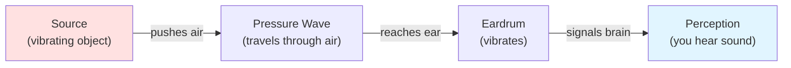
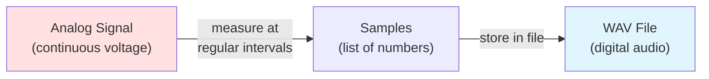
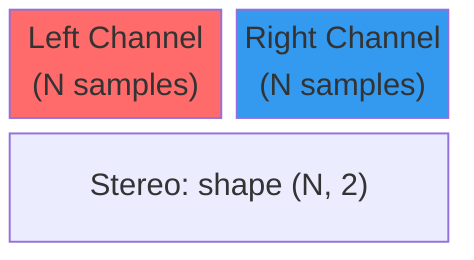
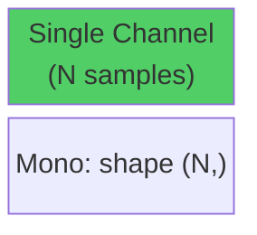
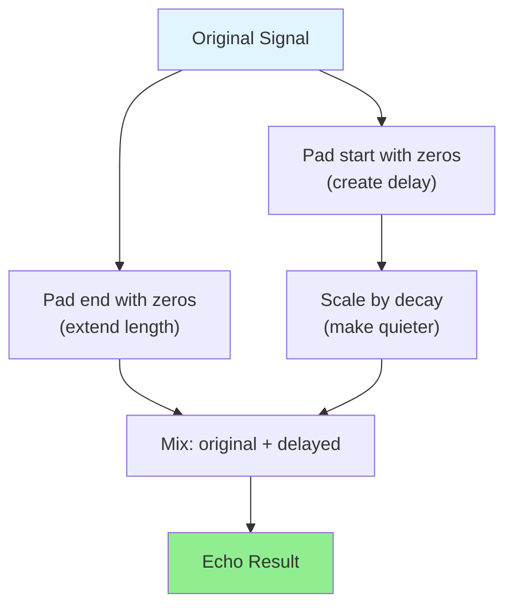
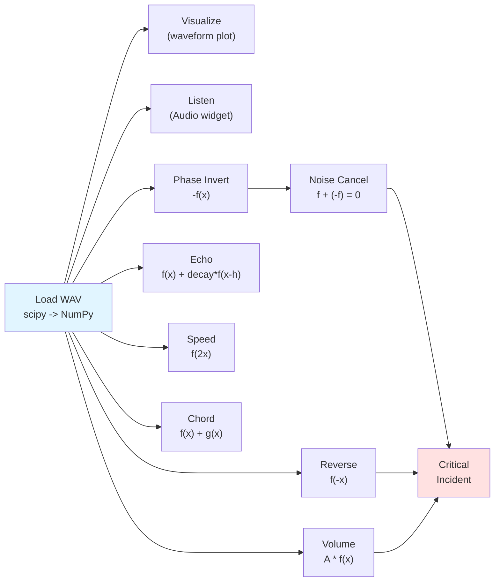

# Lab 05 Field Manual: Digital Waves

**COMP3084 — Data Processing & Analysis**

This document is your technical reference for Lab 05. It covers the foundational
concepts you will need to understand before and during the lab exercises: how
sound works physically, how it is stored digitally, the `int16` data type and
its overflow traps, and how every audio effect you will build maps to a
**Precalculus function transformation** you already know.

Throughout this guide, we will use **musical notes** as our building blocks.
Instead of abstract sine waves, you will generate real notes (A4, C5, E5, ...),
hear them, transform them, and even combine them into chords — all using the
same math from your Precalculus course.

---

## Setup

Run this cell first. Every code cell in this document depends on these imports.

```python
import numpy as np
import matplotlib.pyplot as plt
from IPython.display import Audio, display
```

---

## How Sound Works

### Sound Is Vibration

When you pluck a guitar string, it vibrates back and forth. Those vibrations
push and pull the air molecules around it, creating waves of higher and lower
air pressure that travel outward. When these pressure waves reach your ear,
your eardrum vibrates in response, and your brain interprets those vibrations
as sound.



### Amplitude and Frequency

Two properties define a sound wave:

- **Amplitude** — how far the air pressure swings from rest. Higher amplitude
  = louder sound. Think of it as the *height* of the wave.
- **Frequency** — how many complete vibrations happen per second, measured in
  **Hertz (Hz)**. Higher frequency = higher pitch.
  - A bass guitar note might be 80 Hz (80 vibrations per second).
  - A whistle might be 2000 Hz.
  - Human hearing range: roughly 20 Hz to 20,000 Hz.

### Musical Notes as Frequencies

Every musical note corresponds to a specific frequency. Here are some common
ones:

<details>
<summary>Note ↔ Frequency lookup table</summary>

| Note | Frequency (Hz) | Description |
|------|----------------|-------------|
| A3   | 220.00         | One octave below A4 |
| C4   | 261.63         | Middle C |
| E4   | 329.63         | |
| G4   | 392.00         | |
| A4   | 440.00         | Concert pitch (tuning standard) |
| C5   | 523.25         | |
| E5   | 659.25         | |
| A5   | 880.00         | One octave above A4 |

</details>

**Key pattern:** Going up one **octave** (e.g., A4 → A5) means **doubling**
the frequency. Going down one octave means halving it. This will become
important when we discuss horizontal compression.

<details>
<summary>Wavelength (supplementary — not required for this lab)</summary>

### Wavelength

**Wavelength** is the physical distance between two consecutive peaks of a
wave. It is inversely related to frequency:

$$\text{wavelength} = \frac{\text{speed\_of\_sound}}{\text{frequency}}$$

At room temperature, sound travels at roughly 343 m/s:
- A 220 Hz note (A3) has a wavelength of 343 / 220 ≈ **1.56 meters**
- A 440 Hz note (A4, one octave higher) has a wavelength of 343 / 440 ≈ **0.78 meters**

Understanding the relationship helps explain why higher-frequency sounds seem
"smaller" and lower-frequency sounds seem "bigger."

</details>

### Visualizing a Wave

The following code generates an annotated plot of a pure sine wave, labeling
amplitude, frequency, and period:

```python
freq = 220  # Hz (A3)
duration = 2 / freq  # Show exactly 2 complete cycles
rate = 44100
t = np.linspace(0, duration, int(rate * duration), endpoint=False)
wave = np.sin(2 * np.pi * freq * t)

fig, ax = plt.subplots(figsize=(10, 4))
ax.plot(t * 1000, wave, color='steelblue', linewidth=2)
ax.axhline(y=0, color='gray', linestyle='--', linewidth=0.5)

# Annotate amplitude
ax.annotate('', xy=(0.2, 1.0), xytext=(0.2, 0),
            arrowprops=dict(arrowstyle='<->', color='crimson', lw=2))
ax.text(0.5, 0.5, 'Amplitude', color='crimson', fontsize=12, fontweight='bold')

# Annotate one period
period_ms = 1000 / freq
ax.annotate('', xy=(0, -1.15), xytext=(period_ms, -1.15),
            arrowprops=dict(arrowstyle='<->', color='green', lw=2))
ax.text(period_ms / 2, -1.35, f'Period = 1/{freq} s ≈ {period_ms:.1f} ms',
        color='green', fontsize=11, ha='center', fontweight='bold')

ax.set_xlabel('Time (milliseconds)')
ax.set_ylabel('Amplitude')
ax.set_title(f'Pure Sine Wave — {freq} Hz (A3)')
ax.set_ylim(-1.5, 1.3)
plt.tight_layout()
plt.show()
```

---

## From Physical Wave to Digital Array

### The Microphone: Air Pressure → Voltage

A microphone converts air pressure variations into an electrical voltage that
fluctuates in the same pattern as the sound wave. This continuous, smooth
voltage signal is called an **analog signal**.

### Sampling: Continuous → Discrete

A computer cannot store a continuous signal — it would require infinite data.
Instead, a device called an **Analog-to-Digital Converter (ADC)** measures the
voltage at regular intervals and records each measurement as a number. This
process is called **sampling**.



### Sample Rate

The **sample rate** is how many measurements (samples) are taken per second,
measured in Hz.

<details>
<summary>Common sample rates</summary>

| Sample Rate | Quality | Use Case |
|-------------|---------|----------|
| 8,000 Hz | Telephone | Voice calls |
| 16,000 Hz | Wideband speech | Speech recognition, this lab |
| 44,100 Hz | CD quality | Music |
| 48,000 Hz | Professional | Film, broadcast |

</details>

A sample rate of 16,000 Hz means the signal is measured 16,000 times per
second. A 3.5-second recording at 16,000 Hz contains 56,000 samples — that
is the length of your NumPy array.

### Visualizing Sampling

This plot shows how a continuous wave (blue) is captured as discrete sample
points (red dots). More samples = more accurate representation:

```python
freq = 5  # Hz (slow wave for visibility)
duration = 1.0

# "Continuous" signal (very high resolution)
t_cont = np.linspace(0, duration, 10000)
y_cont = np.sin(2 * np.pi * freq * t_cont)

fig, axes = plt.subplots(1, 2, figsize=(14, 4))

for ax, n_samples, title in zip(axes, [15, 60],
    ['Low Sample Rate (15 samples/sec)', 'Higher Sample Rate (60 samples/sec)']):
    t_samp = np.linspace(0, duration, n_samples, endpoint=False)
    y_samp = np.sin(2 * np.pi * freq * t_samp)

    ax.plot(t_cont, y_cont, color='steelblue', linewidth=1.5, alpha=0.5,
            label='Continuous signal')
    ax.stem(t_samp, y_samp, linefmt='r-', markerfmt='ro', basefmt='gray',
            label=f'{n_samples} samples')
    ax.set_xlabel('Time (seconds)')
    ax.set_ylabel('Amplitude')
    ax.set_title(title)
    ax.legend(fontsize=9)
    ax.axhline(y=0, color='gray', linestyle='--', linewidth=0.5)

plt.tight_layout()
plt.show()
```

**Key observation:** With too few samples, the wave shape is lost. With enough
samples, the discrete points accurately trace the original curve. The rule of
thumb (Nyquist theorem) is that you need **at least 2 samples per cycle** of
the highest frequency you want to capture.

**Why 16,000 Hz is enough for this lab:** A sample rate of 16,000 Hz can
faithfully represent frequencies up to 8,000 Hz (half the sample rate — the
**Nyquist limit**). Since the highest note we use is A5 at 880 Hz, we are well
within that limit. CD-quality audio uses 44,100 Hz because it needs to capture
frequencies up to ~20,000 Hz (the upper edge of human hearing).

---

## Sound as a NumPy Array

### Loading a WAV File

The `scipy.io.wavfile` module reads the binary WAV header for you and returns
the audio data as a NumPy array:

```python
from scipy.io import wavfile

rate, data = wavfile.read('data/stereo_sample.wav')
print(f"Sample Rate: {rate} Hz")       # e.g., 16000
print(f"Shape: {data.shape}")          # (N,) for mono, (N, 2) for stereo
print(f"Dtype: {data.dtype}")          # int16
print(f"Duration: {len(data) / rate:.2f} seconds")
```

### Mono vs Stereo

| Type | Array Shape | Description |
|------|-------------|-------------|
| **Mono** | `(N,)` | One channel — a single 1D list of amplitudes |
| **Stereo** | `(N, 2)` | Two channels — column 0 is Left, column 1 is Right |

```python
# Stereo: shape (N, 2)
left_channel  = data[:, 0]   # 1D array of left speaker values
right_channel = data[:, 1]   # 1D array of right speaker values

# Convert to mono by averaging both channels.
# Averaging preserves the overall loudness: each channel contributes equally,
# and the result has the same amplitude range as either channel alone.
mono = ((data[:, 0].astype(np.float64) + data[:, 1].astype(np.float64)) / 2).astype(np.int16)
```

### Stereo vs Mono Structure





### Duration Formula

```
duration_seconds = number_of_samples / sample_rate
```

For example: 56,000 samples at 16,000 Hz = **3.5 seconds**.

To convert a time in seconds to a sample index:

```
sample_index = int(time_seconds * sample_rate)
```

### Saving a WAV File

To write processed audio back to disk, use `wavfile.write()`:

```python
from scipy.io import wavfile

wavfile.write('output.wav', rate, data)  # data must be a NumPy array (int16)
```

The function writes the sample rate into the WAV header and stores the array as
raw audio bytes. Make sure `data` is `int16` before writing — passing `float64`
will produce a valid file but with a different amplitude scale.

### Visualizing a Waveform

The standard way to visualize sound from a file is a **waveform plot**:
amplitude (y-axis) vs. time in seconds (x-axis).

```python
from scipy.io import wavfile

rate, data = wavfile.read('data/stereo_sample.wav')
# Convert to mono if stereo
if data.ndim == 2:
    data = ((data[:, 0].astype(np.float64) + data[:, 1].astype(np.float64)) / 2).astype(np.int16)

time_axis = np.arange(len(data)) / rate

fig, ax = plt.subplots(figsize=(12, 4))
ax.plot(time_axis, data, linewidth=0.5, color='steelblue')
ax.set_xlabel('Time (seconds)')
ax.set_ylabel('Amplitude')
ax.set_title('Waveform')
ax.axhline(y=0, color='gray', linestyle='--', linewidth=0.5)
plt.tight_layout()
plt.show()
```

### Zoomed / Windowed View

To see individual oscillations, plot a small window (e.g., 10 ms):

```python
window_ms = 10
window_samples = int(window_ms / 1000 * rate)

fig, ax = plt.subplots(figsize=(12, 4))
t = np.arange(window_samples) / rate * 1000
ax.plot(t, data[:window_samples], linewidth=1.0, color='steelblue', marker='.',
        markersize=3)
ax.set_xlabel('Time (milliseconds)')
ax.set_ylabel('Amplitude')
ax.set_title(f'Zoomed View: First {window_ms} ms')
ax.axhline(y=0, color='gray', linestyle='--', linewidth=0.5)
plt.tight_layout()
plt.show()
```

<details>
<summary>Waveform color conventions used in this lab</summary>

### Waveform Color Conventions

| Signal Type | Color | Matplotlib Name |
|-------------|-------|-----------------|
| Original | Blue | `steelblue` |
| Inverted / Noise | Red | `crimson` |
| Cleaned / Result | Green | `green` |
| Echo / Reverb | Orange | `darkorange` |
| Reversed | Purple | `purple` |

</details>

### Listening to Audio

`IPython.display.Audio` renders an HTML5 audio player directly in the
notebook — with play/pause, seek, and time display:

```python
from IPython.display import Audio, display

# From NumPy array (always specify rate!)
display(Audio(data=data, rate=rate))

# For stereo data (shape N, 2), transpose: Audio expects (channels, N)
# display(Audio(data=data.T, rate=rate))
```

---

## The int16 Data Type

### Range and Representation

WAV audio data is typically stored as **`int16`** — a signed 16-bit integer:

| Property | Value |
|----------|-------|
| Bits | 16 |
| Signed | Yes (positive and negative values) |
| Minimum | -32,768 |
| Maximum | +32,767 |
| Total values | 65,536 (2^16) |

The sign matters because sound waves oscillate *above and below* a resting
position (zero). Positive values represent air pushed forward; negative values
represent air pulled back.

```
Maximum positive:  +32,767 = 0111111111111111
Zero (silence):          0 = 0000000000000000
Maximum negative:  -32,768 = 1000000000000000
```

<details>
<summary>Comparing int16 to Lab 04's uint8</summary>

### Comparing int16 to Lab 04's uint8

| Property | Lab 04 (Images) | Lab 05 (Audio) |
|----------|-----------------|----------------|
| Data type | `uint8` | `int16` |
| Range | 0 to 255 | -32,768 to +32,767 |
| Signed? | No (unsigned) | Yes (signed) |
| Overflow example | `200 + 100 = 44` (wraps: `300 - 256 = 44`) | `20000 × 2 = -25536` (wraps: `40000 - 65536 = -25536`) |
| Fix | Cast to `float64`, clip to [0, 255] | Cast to `float64`, clip to [-32768, 32767] |

</details>

### int16 Overflow — The Same Trap, Different Numbers

Just like `uint8` in Lab 04, `int16` arithmetic wraps around silently:

```python
import numpy as np

a = np.int16(20000)
b = np.int16(20000)
print(a + b)   # -25536, NOT 40000!

c = np.int16(20000)
print(c * np.int16(2))   # -25536 again!
```

**Why:** `int16` can only hold values up to +32,767. When the result exceeds
that, it wraps around into negative territory. This is **silent** — no error
is raised, and the corrupted value is stored as if nothing happened.

**The fix is always the same pattern:**

```python
# SAFE: convert to float, do math, clip, cast back
result = data.astype(np.float64) * 2.0
result = np.clip(result, -32768, 32767)
result = result.astype(np.int16)
```

### What Overflow Sounds Like

If you multiply audio by 2 without protecting against overflow, the peaks of
the waveform wrap to the opposite extreme, creating harsh distortion called
**clipping**. Visually, the smooth wave tops are "chopped off" and replaced
with jagged spikes.

```python
rate = 16000
t = np.arange(rate) / rate  # 1 second
clean = (np.sin(2 * np.pi * 440 * t) * 20000).astype(np.int16)

# Overflow: multiply int16 directly (wraps around!)
overflowed = clean * np.int16(2)

# Safe: multiply as float, clip, cast
safe = np.clip(clean.astype(np.float64) * 2, -32768, 32767).astype(np.int16)

fig, axes = plt.subplots(3, 1, figsize=(12, 7), sharex=True)
window = int(0.01 * rate)  # 10ms

axes[0].plot(np.arange(window) / rate * 1000, clean[:window], color='steelblue')
axes[0].set_title('Original A4 (peak = 20,000)')

axes[1].plot(np.arange(window) / rate * 1000, overflowed[:window], color='crimson')
axes[1].set_title('Overflowed: int16(20000) x 2 = -25536 (WRONG!)')

axes[2].plot(np.arange(window) / rate * 1000, safe[:window], color='green')
axes[2].set_title('Safe: float64 -> clip -> int16 (clipped at +/-32767)')

for ax in axes:
    ax.set_ylabel('Amplitude')
    ax.axhline(y=0, color='gray', linestyle='--', linewidth=0.5)
axes[-1].set_xlabel('Time (milliseconds)')
plt.tight_layout()
plt.show()
```

---

## Helper Functions: Our Audio Toolkit

Before exploring transformations, we define three helper functions that will
keep all later code clean and compact. Run this cell — everything that follows
depends on it.

### `generate_note` — Create a Musical Note

A musical note is nothing more than a sine wave at a specific frequency:

$$\text{note}(t) = A \cdot \sin(2\pi \cdot f \cdot t)$$

where $A$ is the amplitude (volume) and $f$ is the frequency in Hz.

```python
RATE = 16000  # Sample rate used throughout this document

def generate_note(freq, duration=2.0, rate=RATE, amplitude=10000):
    """Generate a pure sine wave at the given frequency.

    Args:
        freq: float, frequency in Hz (e.g., 440.0 for A4)
        duration: float, length in seconds (default 2.0)
        rate: int, sample rate in Hz (default 16000)
        amplitude: int, peak amplitude (default 10000)

    Returns:
        NumPy array of shape (int(rate * duration),), dtype int16
    """
    t = np.linspace(0, duration, int(rate * duration), endpoint=False)
    samples = (np.sin(2 * np.pi * freq * t) * amplitude).astype(np.int16)
    return samples
```

```python
# Quick test: generate and listen to A4 (440 Hz)
A4 = generate_note(440)
print(f"A4: {len(A4)} samples, {len(A4)/RATE:.1f}s, dtype={A4.dtype}")
display(Audio(data=A4, rate=RATE))
```

### `compare_sounds` — See and Hear Two Signals

This is our main visualization tool. It plots two sound arrays so we can
**see** the transformation, then plays both so we can **hear** the difference.

**Features:**

- **Side-by-side** (`layout='side'`): each signal on its own subplot —
  best when amplitude or length differ significantly.
- **Overlapped** (`layout='overlap'`): both signals on the same axes —
  best for comparing shape (e.g., original vs. inverted).
- **Zoom** (`zoom`): controls what fraction of the signal is shown.
  `1.0` shows everything, `0.5` shows the first half, `0.1` shows the
  first 10%, etc. Useful for seeing individual oscillations.

```python
def compare_sounds(s1, s2, label1='Signal 1', label2='Signal 2',
                   rate=RATE, layout='side', zoom=1.0,
                   color1='steelblue', color2='crimson',
                   normalize=False):
    """Plot and play two sound arrays for comparison.

    Args:
        s1, s2: NumPy arrays (int16 or float) — the two signals to compare.
        label1, label2: str — display names for each signal.
        rate: int — sample rate in Hz.
        layout: 'side' for stacked subplots, 'overlap' for same axes.
        zoom: float in (0, 1] — fraction of the signal to display.
              1.0 = full signal, 0.1 = first 10% (zoomed in).
        color1, color2: matplotlib color names for each signal.
        normalize: Whether Audio playback is normalized or not. Default False
    """
    # Compute the window of samples to display
    n1 = max(1, int(len(s1) * zoom))
    n2 = max(1, int(len(s2) * zoom))
    t1 = np.arange(n1) / rate
    t2 = np.arange(n2) / rate

    zoom_label = f' (zoom={zoom})' if zoom < 1.0 else ''

    if layout == 'overlap':
        fig, ax = plt.subplots(figsize=(12, 4))
        ax.plot(t1, s1[:n1], color=color1, linewidth=1.5, alpha=0.8, label=label1)
        ax.plot(t2, s2[:n2], color=color2, linewidth=1.5, alpha=0.8, label=label2)
        ax.axhline(y=0, color='gray', linestyle='--', linewidth=0.5)
        ax.set_xlabel('Time (seconds)')
        ax.set_ylabel('Amplitude')
        ax.set_title(f'{label1} vs {label2}{zoom_label}')
        ax.legend()
        plt.tight_layout()
        plt.show()
    else:  # 'side' — stacked subplots
        fig, axes = plt.subplots(2, 1, figsize=(12, 5))
        axes[0].plot(t1, s1[:n1], color=color1, linewidth=1.0)
        axes[0].set_title(f'{label1}{zoom_label}')
        axes[0].set_ylabel('Amplitude')
        axes[0].axhline(y=0, color='gray', linestyle='--', linewidth=0.5)

        axes[1].plot(t2, s2[:n2], color=color2, linewidth=1.0)
        axes[1].set_title(f'{label2}{zoom_label}')
        axes[1].set_ylabel('Amplitude')
        axes[1].axhline(y=0, color='gray', linestyle='--', linewidth=0.5)
        axes[1].set_xlabel('Time (seconds)')

        plt.tight_layout()
        plt.show()

    # Hear — play both signals
    # normalize=True: pass raw int16, Audio handles it natively (each signal
    #   is scaled to its own peak — relative volume differences are lost).
    # normalize=False: manually scale to [-1, 1] first, so Audio preserves
    #   the actual amplitude difference between signals.
    print(f"{label1}:")
    if normalize:
        display(Audio(data=s1, rate=rate, normalize=True))
    else:
        display(Audio(data=s1.astype(np.float32) / 32768.0, rate=rate, normalize=False))
    print(f"{label2}:")
    if normalize:
        display(Audio(data=s2, rate=rate, normalize=True))
    else:
        display(Audio(data=s2.astype(np.float32) / 32768.0, rate=rate, normalize=False))
```

### `play` — Quick Listen to a Single Signal

Sometimes we just want to hear one signal without plotting:

```python
def play(signal, label='', rate=RATE):
    """Play a single signal with an optional label."""
    if label:
        print(f"{label}:")
    display(Audio(data=signal, rate=rate))
```

### Quick Test of the Toolkit

Let's verify everything works by generating two notes and comparing them:

```python
A4 = generate_note(440)
A5 = generate_note(880)

compare_sounds(A4, A5, 'A4 (440 Hz)', 'A5 (880 Hz)', zoom=0.05)
```

You should see two plots: A5 has twice as many oscillations in the same time
window (because its frequency is double). You should hear A4 as a lower note
and A5 as a higher note.

---

## Audio Effects as Function Transformations

This is the key bridge between the math you already know and the audio
processing you will implement. Every effect corresponds to a function
transformation from Precalculus.

### Reference: Function Transformation Rules

If $f(x)$ is your original function (the sound waveform), these transformations
produce predictable changes:

| Transformation | Formula | Effect on Graph | Effect on Sound |
|----------------|---------|-----------------|-----------------|
| **Vertical Stretch** | $A \cdot f(x), \quad A > 1$ | Wave gets taller | Louder |
| **Vertical Compression** | $A \cdot f(x), \quad 0 < A < 1$ | Wave gets shorter | Quieter |
| **Reflection (x-axis)** | $-f(x)$ | Wave flips upside down | Sounds the same! |
| **Vertical Shift** | $f(x) + k$ | Wave moves up/down | DC offset (bad) |
| **Horizontal Shift** | $f(x - h)$ | Wave moves right by $h$ | Delayed copy |
| **Horizontal Reflection** | $f(-x)$ | Wave reads right-to-left | Reversed playback |
| **Horizontal Compression** | $f(2x)$ | Wave squeezes together | Faster + higher pitch |
| **Horizontal Stretch** | $f(x/2)$ | Wave spreads apart | Slower + lower pitch |
| **Addition** | $f(x) + g(x)$ | Waves combine | Chord / harmony |

Now let's hear each of these, one by one.

---

## Volume Control — Vertical Scaling

### The Math

```
louder[i]  = factor * data[i],    where factor > 1
quieter[i] = factor * data[i],    where 0 < factor < 1
```

In NumPy, this is a single vectorized operation. But we must protect against
int16 overflow (see the int16 section above):

```python
def adjust_volume(data, factor):
    """Scale audio volume by a constant factor (overflow-safe)."""
    result = data.astype(np.float64) * factor
    result = np.clip(result, -32768, 32767)
    return result.astype(np.int16)
```

### Hearing Volume Changes

Let's generate A4 and compare it at different volumes:

```python
A4 = generate_note(440)
A4_loud  = adjust_volume(A4, 2.0)
A4_quiet = adjust_volume(A4, 0.3)

# Loud vs original — side-by-side, zoomed to see amplitude difference
compare_sounds(A4, A4_loud, 'A4 (original)', 'A4 x 2.0 (louder)', zoom=0.05)
```

```python
# Quiet vs original — overlapped to directly compare wave heights
compare_sounds(A4, A4_quiet, 'A4 (original)', 'A4 x 0.3 (quieter)',
               layout='overlap', zoom=0.05, color2='darkorange')
```

The overlapped view makes it obvious: the quieter wave traces the same shape
as the original, just with shorter peaks. It is the same note, same pitch —
only the volume changed.

<details>
<summary>Why clipping sounds bad</summary>

When a wave is too loud and gets clipped at ±32,767, the smooth peaks become
flat plateaus. The ear perceives this as harsh, buzzy distortion. Professional
audio engineers call this "hard clipping" and avoid it carefully.

</details>

---

## Phase Inversion — The Mirror Wave

### The Math (Precalculus: Reflection over x-axis)

```
inverted = -f(x)
```

```python
A4 = generate_note(440)
A4_inv = -A4  # A single NumPy operation!
```

### Seeing and Hearing the Inversion

```python
# Overlapped view clearly shows the mirror image
compare_sounds(A4, A4_inv, 'A4 (original)', 'A4 (inverted: -f(x))',
               layout='overlap', zoom=0.02, color2='crimson')
```

**Discovery:** Listen carefully — they sound *identical*! The graph proves they
are different (one is the mirror image of the other), but the human ear
perceives amplitude *patterns*, not whether peaks are positive or negative.

---

## Noise Cancellation — Destructive Interference

### The Math (Precalculus: Additive Inverse)

When two waves of equal amplitude and opposite phase are added together, they
cancel perfectly:

```
f(x) + (-f(x)) = 0    for every sample
```

This is the principle behind **Active Noise Cancellation** (ANC) used in
noise-canceling headphones. The headphones record ambient noise with a
microphone, compute the inverse signal, and play it through the speakers.
The noise and anti-noise combine to produce silence.

### Perfect Cancellation Demo

```python
A4 = generate_note(440)
anti_A4 = -A4

# Use float64 for consistency with our safe-arithmetic pattern
result = A4.astype(np.float64) + anti_A4.astype(np.float64)

print(f"Sum min: {result.min()}, max: {result.max()}")
print(f"All zeros? {np.all(result == 0)}")
result = result.astype(np.int16)
```

### Visualizing Cancellation

```python
window = int(0.02 * RATE)  # 20 ms
t_win = np.arange(window) / RATE * 1000  # milliseconds

fig, axes = plt.subplots(3, 1, figsize=(12, 7), sharex=True)

axes[0].plot(t_win, A4[:window], color='steelblue', linewidth=2)
axes[0].set_title('A4: f(x)')
axes[0].fill_between(t_win, A4[:window], alpha=0.2, color='steelblue')

axes[1].plot(t_win, anti_A4[:window], color='crimson', linewidth=2)
axes[1].set_title('Anti-A4: -f(x)')
axes[1].fill_between(t_win, anti_A4[:window], alpha=0.2, color='crimson')

axes[2].plot(t_win, result[:window], color='green', linewidth=2)
axes[2].set_title('Sum: f(x) + (-f(x)) = 0  (Silence)')
axes[2].set_ylim(-12000, 12000)

for ax in axes:
    ax.axhline(y=0, color='gray', linestyle='--', linewidth=0.5)
    ax.set_ylabel('Amplitude')
axes[-1].set_xlabel('Time (milliseconds)')
plt.tight_layout()
plt.show()

play(A4, 'A4')
play(anti_A4, 'Anti-A4')
play(result, 'Sum (should be silent)')
```

<details>
<summary>Forensic application — preview of the Critical Incident</summary>

### Forensic Application

If you have a recording contaminated by a *known* noise (such as a constant
hum), and you have a clean copy of that noise, you can subtract it:

```
cleaned = dirty_recording - known_noise
```

The noise cancels out, leaving only the signal of interest (a voice, a
message, etc.). This only works if the noise is **exactly the same** in both
files — same frequency, same amplitude, same phase.

In the lab's Critical Incident exercise, you will apply exactly this technique:
given a contaminated recording and a separate file containing the noise, you
will subtract the noise, reverse the result, and boost its volume to recover a
hidden message. Each step uses a transformation you have already learned.

</details>

---

## Pitch and Speed — Horizontal Compression & Stretch

### The Math (Precalculus: Horizontal Compression/Stretch)

```
f(2x)    →  Wave squeezes together → faster playback + higher pitch
f(x/2)   →  Wave spreads apart     → slower playback + lower pitch
```

This is where musical notes make the concept crystal clear. A note one octave
higher has **exactly double** the frequency — which is precisely what
horizontal compression by a factor of 2 does to the waveform.

### Hearing the Octave Relationship

```python
A4 = generate_note(440)   # A4 = 440 Hz
A5 = generate_note(880)   # A5 = 880 Hz (one octave up = double frequency)
A3 = generate_note(220)   # A3 = 220 Hz (one octave down = half frequency)

# Compare A4 vs A5 — the higher note has tighter oscillations
compare_sounds(A4, A5, 'A4 (440 Hz)', 'A5 (880 Hz) — one octave up',
               zoom=0.02)
```

```python
# Compare A4 vs A3 — the lower note has wider oscillations
compare_sounds(A4, A3, 'A4 (440 Hz)', 'A3 (220 Hz) — one octave down',
               zoom=0.02, color2='darkorange')
```

### Speed Change by Skipping Samples

Skipping every other sample doubles the speed (and raises the pitch by one
octave):

```python
A4 = generate_note(440, duration=2.0)
fast = A4[::2]   # Keep every 2nd sample → half the samples → double speed

print(f"Original: {len(A4)} samples ({len(A4)/RATE:.2f}s)")
print(f"Fast (::2): {len(fast)} samples ({len(fast)/RATE:.2f}s)")
# Fewer samples played at the same sample rate = shorter duration = faster playback.

# The fast version plays at double speed → sounds like A5!
compare_sounds(A4, fast, 'A4 (original, 2.0s)', 'A4[::2] (sounds like A5, 1.0s)',
               zoom=0.05)
```

<details>
<summary>Why speed and pitch are linked</summary>

When you skip samples, the waveform gets compressed in time. The same number
of oscillations now fit into a shorter duration, which means more oscillations
per second = higher frequency = higher pitch. This is why chipmunk voices
sound both fast *and* high-pitched.

</details>

### Arbitrary Speed with Interpolation

For non-integer speed factors, use interpolation:

```python
def change_speed(data, factor):
    """Resample audio to change speed/pitch.

    factor > 1 → faster/higher pitch
    factor < 1 → slower/lower pitch
    """
    new_length = int(len(data) / factor)
    old_indices = np.linspace(0, len(data) - 1, new_length)
    return np.interp(old_indices, np.arange(len(data)), data).astype(np.int16)
```

```python
A4 = generate_note(440, duration=2.0)
A4_fast = change_speed(A4, 2.0)   # Double speed → sounds like A5
A4_slow = change_speed(A4, 0.5)   # Half speed → sounds like A3

print(f"Original: {len(A4)} samples ({len(A4)/RATE:.2f}s)")
print(f"Fast (2.0x): {len(A4_fast)} samples ({len(A4_fast)/RATE:.2f}s)")
print(f"Slow (0.5x): {len(A4_slow)} samples ({len(A4_slow)/RATE:.2f}s)")

compare_sounds(A4, A4_fast, 'A4 (original)', 'A4 sped up 2x (sounds like A5)')
```

```python
compare_sounds(A4, A4_slow, 'A4 (original)', 'A4 slowed 0.5x (sounds like A3)',
               color2='darkorange')
```

---

## Chords — Addition of Functions

### The Math (Precalculus: Sum of Functions)

```
chord(x) = f(x) + g(x) + h(x)
```

When you play multiple notes at the same time, their waveforms **add
together**. The result is a more complex wave that your ear perceives as a
**chord** — multiple pitches sounding simultaneously.

### Building an A-Major Chord

An A-major chord consists of three notes: **A4** (440 Hz), **C#5** (554.37 Hz),
and **E5** (659.25 Hz).

```python
A4  = generate_note(440.00, amplitude=8000)
Cs5 = generate_note(554.37, amplitude=8000)
E5  = generate_note(659.25, amplitude=8000)

# Add all three — use float64 to avoid overflow, then clip and cast back
chord = np.clip(
    A4.astype(np.float64) + Cs5.astype(np.float64) + E5.astype(np.float64),
    -32768, 32767
).astype(np.int16)

print(f"A4 peak: {A4.max()}, Chord peak: {chord.max()}")
```

### Seeing the Chord

```python
# Compare a single note vs the chord — zoomed in to see the waveform shape
compare_sounds(A4, chord, 'A4 alone', 'A-Major Chord (A4 + C#5 + E5)',
               zoom=0.01, color2='darkorange')
```

The chord waveform looks more complex than a single note — it is no longer a
clean sine wave. Your ear separates the complex wave back into the three
individual pitches, which is why you hear harmony rather than noise.

**A note on normalization:** We used `amplitude=8000` for each note (instead of
the default 10,000) so that the sum of three notes stays below the int16 limit
(`3 × 8000 = 24000 < 32767`). In professional audio, you would instead
**normalize** after mixing: divide the combined signal by the number of sources,
preserving relative amplitudes without clipping. For this lab, choosing smaller
amplitudes up front is the simpler approach.

### Hearing the Individual Notes Then the Chord

```python
play(A4,    'A4  (440 Hz)')
play(Cs5,   'C#5 (554 Hz)')
play(E5,    'E5  (659 Hz)')
play(chord, 'A-Major Chord (all three together)')
```

### Visualizing All Three Components

```python
n = int(0.02 * RATE)  # 20 ms window
t_win = np.arange(n) / RATE * 1000  # milliseconds

fig, axes = plt.subplots(4, 1, figsize=(12, 10), sharex=True)

for ax, signal, title, color in zip(axes,
    [A4, Cs5, E5, chord],
    ['A4 (440 Hz)', 'C#5 (554 Hz)', 'E5 (659 Hz)',
     'Chord: A4 + C#5 + E5'],
    ['steelblue', 'darkorange', 'green', 'purple']):
    ax.plot(t_win, signal[:n], color=color, linewidth=1.5)
    ax.axhline(y=0, color='gray', linestyle='--', linewidth=0.5)
    ax.set_ylabel('Amplitude')
    ax.set_title(title)

axes[-1].set_xlabel('Time (milliseconds)')
plt.tight_layout()
plt.show()
```

---

## Reversal — Horizontal Reflection

### The Math (Precalculus: Reflection over y-axis)

```
reversed = f(-x)    →    data[::-1]
```

```python
reversed_audio = data[::-1].copy()
```

This reads the array from end to start — the last sample becomes the first.
The result is the audio played backward.

**Note:** `.copy()` is important because `[::-1]` creates a reversed *view*,
not a new array. Some functions (e.g., `wavfile.write()`) do not accept views
and require a standard contiguous array. Calling `.copy()` produces one.

### Hearing Reversal with a Melody

Reversal is more interesting with a sequence of notes than with a single tone.
Let's create a short ascending melody and reverse it:

```python
# Ascending: C4 → E4 → G4 → C5 (0.5 seconds each)
melody_notes = [
    generate_note(261.63, duration=0.5),  # C4
    generate_note(329.63, duration=0.5),  # E4
    generate_note(392.00, duration=0.5),  # G4
    generate_note(523.25, duration=0.5),  # C5
]
melody = np.concatenate(melody_notes)
melody_rev = melody[::-1].copy()

compare_sounds(melody, melody_rev, 'Melody (ascending)', 'Melody (reversed — descending)',
               color2='purple')
```

The ascending melody (C4 → E4 → G4 → C5) becomes descending (C5 → G4 → E4 → C4)
when reversed. The waveform is simply the mirror image read from right to left.

---

## Echo — Horizontal Translation

### The Math

An echo is a delayed, quieter copy of the original sound mixed back in:

```
echo(x) = f(x) + decay * f(x - delay)
```

- `delay` — how long before the echo arrives (in samples: `int(seconds * rate)`)
- `decay` — how loud the echo is relative to the original (0.0 to 1.0)

### Array Implementation

Since we cannot "shift" an array in place, we create the delay by padding with
zeros:

```
Original:     [s0  s1  s2  s3  s4  s5  s6  s7]  [0   0   0 ]
Delayed:      [0   0   0 ] [s0  s1  s2  s3  s4   s5  s6  s7]
              ^ delay_samples zeros
```

Both arrays must be the same total length. Then we add:

```
result[i] = original_padded[i] + decay * delayed[i]
```

### Echo Diagram



### Hearing Echo on a Melody

Echo is more dramatic with a melody than with a sustained note:

```python
# Regenerate the melody so this section works independently of the reversal section
melody_notes = [
    generate_note(261.63, duration=0.5),  # C4
    generate_note(329.63, duration=0.5),  # E4
    generate_note(392.00, duration=0.5),  # G4
    generate_note(523.25, duration=0.5),  # C5
]
melody = np.concatenate(melody_notes)

# Add echo: 0.3 second delay, 0.5 decay
delay_samples = int(0.3 * RATE)
delayed  = np.concatenate([np.zeros(delay_samples, dtype=np.int16), melody])
original = np.concatenate([melody, np.zeros(delay_samples, dtype=np.int16)])

echo = np.clip(
    original.astype(np.float64) + 0.5 * delayed.astype(np.float64),
    -32768, 32767
).astype(np.int16)

compare_sounds(melody, echo,
               'Melody (dry)', 'Melody (with echo: 0.3s delay, 0.5 decay)',
               color2='darkorange')
```

### Multi-Echo (Reverb)

Real rooms produce many reflections. Simulate this with multiple echoes, each
one delayed further and decayed more:

```
reverb(x) = f(x) + decay^1 * f(x - d) + decay^2 * f(x - 2d) + decay^3 * f(x - 3d) + ...
```

Each successive echo is `decay` times quieter than the previous one. After
4-5 reflections, the echo is usually inaudible.

---

## Processing Pipeline Overview

The following diagram shows the flow of audio through the different processing
paths in this lab:



Each arrow represents a function you will implement. The **Critical Incident**
at the end combines noise cancellation, reversal, and volume boost into a single
forensic recovery pipeline. Expect to chain three operations in sequence:
subtract the noise file, reverse the cleaned signal, then amplify it so the
hidden message is audible.

---

## The See-Then-Hear Pattern

Unlike images (which you verify by looking at them), audio requires **two
forms of verification**:

1. **See** — Plot the waveform to confirm the transformation looks correct
   (wave got taller, flipped, shifted, etc.)
2. **Hear** — Play the audio to confirm it sounds correct (louder, reversed,
   echoed, etc.)

Every exercise in the notebook follows this pattern. The `compare_sounds`
helper combines both steps into a single call:

```python
# Example: see and hear the effect of doubling volume
A4 = generate_note(440)
A4_loud = adjust_volume(A4, 2.0)
compare_sounds(A4, A4_loud, 'Original', 'Volume x 2', zoom=0.05)
```

---

## Quick Reference Summary

| Concept | Key Point |
|---------|-----------|
| **Sound** | Vibrations creating pressure waves in air |
| **Amplitude** | Height of the wave; controls volume |
| **Frequency** | Vibrations per second (Hz); controls pitch |
| **Musical Notes** | Each note = specific frequency (A4 = 440 Hz, octave up = 2x freq) |
| **Sample Rate** | Measurements per second (e.g., 16,000 Hz) |
| **Duration** | `len(data) / sample_rate` seconds |
| **Mono** | 1D array: shape `(N,)` |
| **Stereo** | 2D array: shape `(N, 2)` — left and right channels |
| **int16** | Signed 16-bit integer, range -32,768 to +32,767 |
| **Overflow** | `int16(20000) x 2 = -25536`; always cast to float64 first |
| **Volume** | Vertical scaling: `factor * data` |
| **Phase Inversion** | Negate: `-data`; sounds the same to human ears |
| **Noise Cancellation** | `signal + (-signal) = 0`; subtract known noise |
| **Chords** | Add waves: `note1 + note2 + note3` = harmony |
| **Echo** | Horizontal shift: pad with zeros, mix with decay |
| **Reversal** | `data[::-1].copy()`; plays audio backward |
| **Speed/Pitch** | Skip samples (`data[::2]`) or interpolate; speed and pitch are linked |
| **See-Then-Hear** | Always verify with both a waveform plot AND audio playback |
| **WAV I/O** | `wavfile.read()` → `(rate, data)`; `wavfile.write(path, rate, data)` |

### Helper Function Quick Reference

| Function | Purpose | Example |
|----------|---------|---------|
| `generate_note(freq)` | Create a 2-second sine wave at given Hz | `A4 = generate_note(440)` |
| `compare_sounds(s1, s2)` | Plot and play two signals | `compare_sounds(A4, A5, 'A4', 'A5', zoom=0.05)` |
| `play(signal)` | Quick listen to one signal | `play(chord, 'A-Major')` |
| `adjust_volume(data, factor)` | Scale volume (overflow-safe) | `loud = adjust_volume(A4, 2.0)` |
| `change_speed(data, factor)` | Resample to change speed/pitch | `fast = change_speed(A4, 2.0)` |
