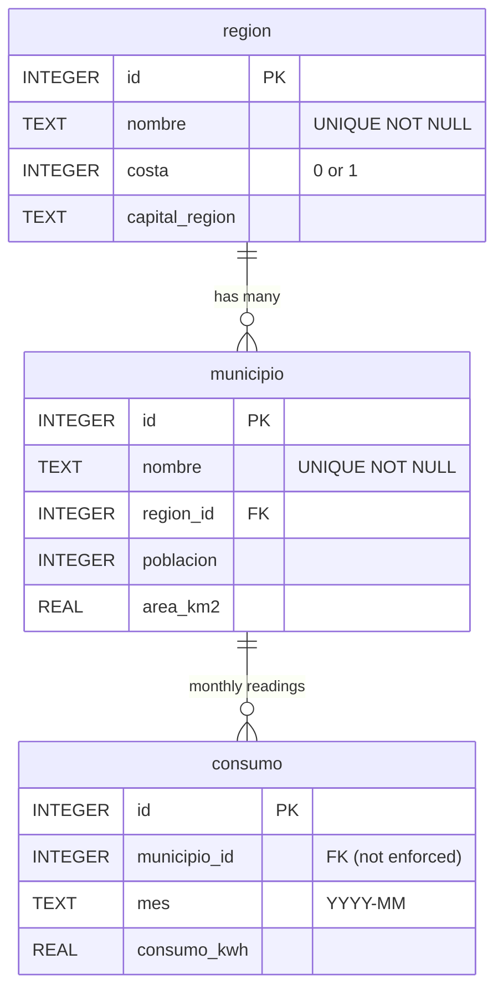

# Lab 08 — `municipios.db` ER Diagram

Three tables archived from the Lab 06 CSVs. `consumo` deliberately has **no
foreign-key constraint** on `municipio_id`, which is why the orphan row
(`municipio_id = 999`) survives and the `LEFT JOIN ... IS NULL` probe in
Exercise 4.3 can find it.

## Cardinality at a glance

| Parent | Child | Relationship | Enforced? |
|--------|-------|--------------|-----------|
| `region.id` | `municipio.region_id` | one-to-many | yes (FK) |
| `municipio.id` | `consumo.municipio_id` | one-to-many | **no** — allows the orphan row |

## Row counts

| Table | Rows |
|-------|------|
| `region` | 6 |
| `municipio` | 78 |
| `consumo` | 937 (936 valid + 1 orphan with `municipio_id = 999`) |
